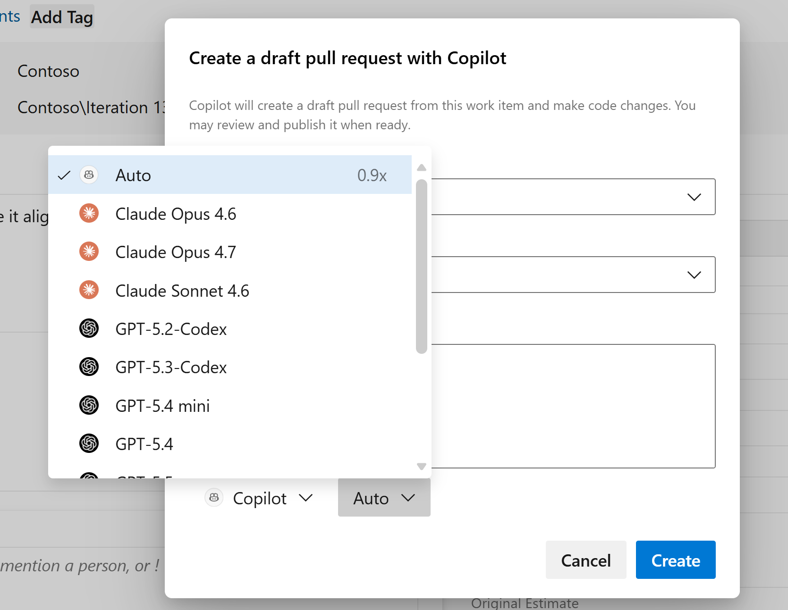

### Coding agent model selection option

Different models can produce different results when using the Copilot coding agent with work items, particularly when using custom instructions or custom agents.

You can now choose which model the coding agent uses when creating a pull request from a work item, giving you more control over what works best for your team and codebase.

> [!div class="mx-imgBorder"]
> 
