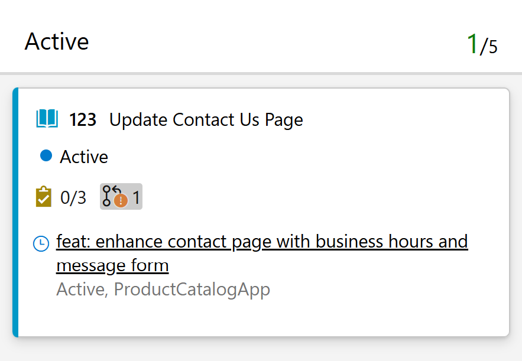

### Pull request annotations on cards

We've added a new pull request annotation to board card settings. When enabled (the default setting), linked pull requests are displayed directly on cards.

This gives teams greater visibility into development activity without leaving the board. You can quickly see which work items have associated pull requests, making it easier to track progress, identify work awaiting review, and spot items that may be blocked on code changes.

> [!div class="mx-imgBorder"]
> 
