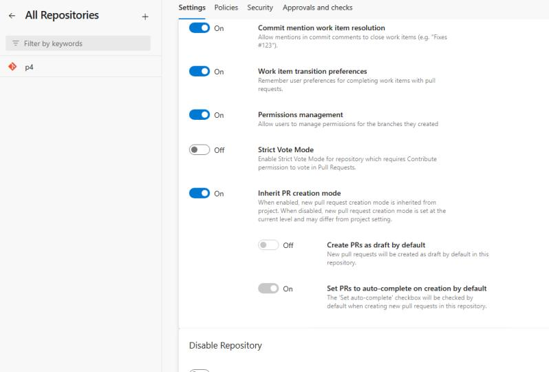
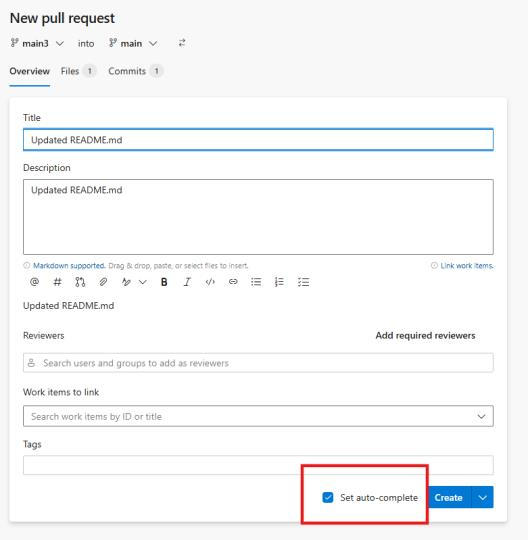

### Retirement of Global Personal Access Tokens in Azure DevOps

Azure DevOps is retiring **Global Personal Access Tokens (PATs)** to reduce security risk and promote safer, scoped authentication. Global PATs grant access across all organizations a user belongs to, creating an overly broad and high‑impact credential that no longer aligns with modern security best practices. 

Customers are encouraged to move to **organization‑scoped PATs** where necessary or adopt **Microsoft Entra–based authentication** for improved security and governance. 

**Key dates:** 

* ~~On March 15, 2026, creation and regeneration of global PATs will be blocked.~~

* December 1, 2026, all existing global PATs will be fully decommissioned and stop working. Customers should review any workflows or integrations using global PATs and begin transitioning ahead of these deadlines to avoid disruption. 

Learn more in the announcement blog: [Retirement of Global Personal Access Tokens in Azure DevOps](https://devblogs.microsoft.com/devops/retirement-of-global-personal-access-tokens-in-azure-devops/).

### Auto-complete pull requests by default

We’ve added a new repository setting: **Set PRs to auto-complete on creation by default**.

> 

This setting controls the default state of the **Set auto-complete** toggle for newly created pull requests.

When this setting is enabled, every new PR will automatically have Set auto-complete turned on.
When it’s disabled, new PRs will start with Set auto-complete turned off, and authors can choose to enable it manually.

> 

To turn on this setting, go to **Project settings → Repositories → Settings**. You can enable it for the entire project so all repositories use the same configuration, or update it directly within an individual repository’s settings.