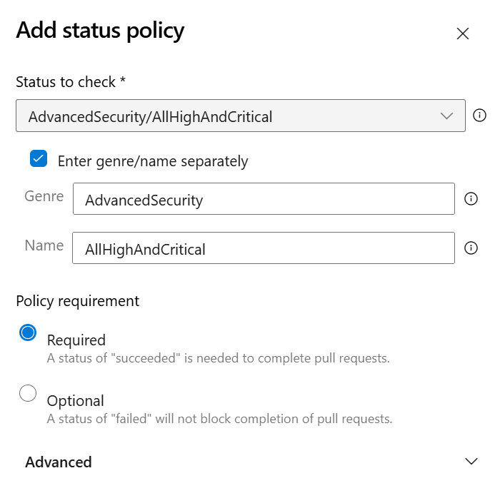
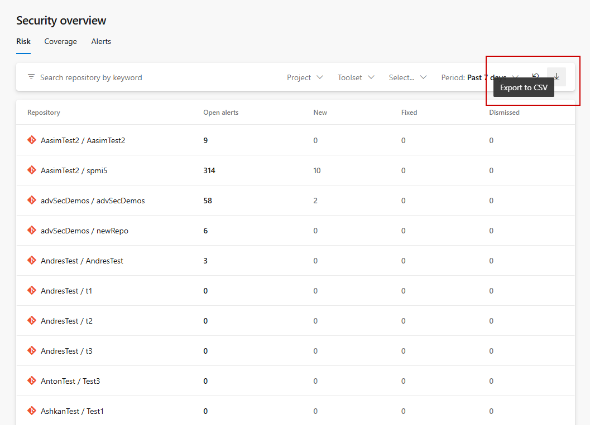

### Advanced Security status checks for pull requests

Advanced Security now publishes configurable status checks that integrate with Azure DevOps' built-in branch policy system. When Advanced Security scanning runs against a pull request, it automatically publishes status checks that can be used as required branch policies.

Two new status checks are available:

- **AdvancedSecurity/NewHighAndCritical** — fails only when the pull request introduces new high or critical severity alerts, ignoring pre-existing findings in the target branch.
- **AdvancedSecurity/AllHighAndCritical** — fails when there are any high or critical severity alerts present, including pre-existing alerts in the target branch.

Status checks use fail-open behavior: repositories where Advanced Security is not enabled pass the check automatically, preventing workflow blocking for non-onboarded repositories.

To use these status checks, add them as required status policies on your branches through the branch policy settings. For more information and setup, see [Advanced Security status checks](https://aka.ms/ghazdo-status-checks).

> [!div class="mx-imgBorder"]
> 

### Export results from security overview

You can now export results from security overview to a CSV file. Both the Risk and Coverage views support export, giving you a downloadable snapshot of your organization's security posture across repositories. The upcoming Alerts page, which gives you insight into specific alerts across your organization, will also support export functionality with a max of the first 1,000 alerts exported.

This feature is only available via the UI at this time.

> [!div class="mx-imgBorder"]
> 

### Audit log events for Advanced Security enablement changes

Azure DevOps now records audit log events whenever GitHub Advanced Security enablement settings change. When Advanced Security features are enabled or disabled at the repository, project, or organization level, a detailed event is captured in the [Azure DevOps audit log](/azure/devops/organizations/audit/azure-devops-auditing).

Audit log entries include the actor, timestamp, and the specific settings that were modified, including:

- Advanced Security (bundled) or Code Security/Secret Protection plans (standalone)
- CodeQL default setup
- Dependency scanning default setup
- Secret push protection

These events provide visibility into when and by whom security features are configured across your organization, supporting compliance and governance requirements.

### Automatic cleanup of alerts from stale pipeline configurations

Advanced Security now automatically hides alerts associated with pipeline configurations that have not been run in over 90 days. Alert fingerprints in Advanced Security are tied to specific pipeline configurations, so when a pipeline job or stage is changed, previously associated alerts can become orphaned if they were also resolved as part of the pipeline update.

With this change, alerts linked to stale pipeline configurations are automatically hidden, reducing noise and ensuring that your alert results reflect your current CI/CD setup. If you re-run a previously stale pipeline configuration after its alerts have been hidden, any previously open alerts will return as active, open alerts. You can also use the delete analysis API to manually hide alerts associated with specific pipeline configurations that are no longer in use.
