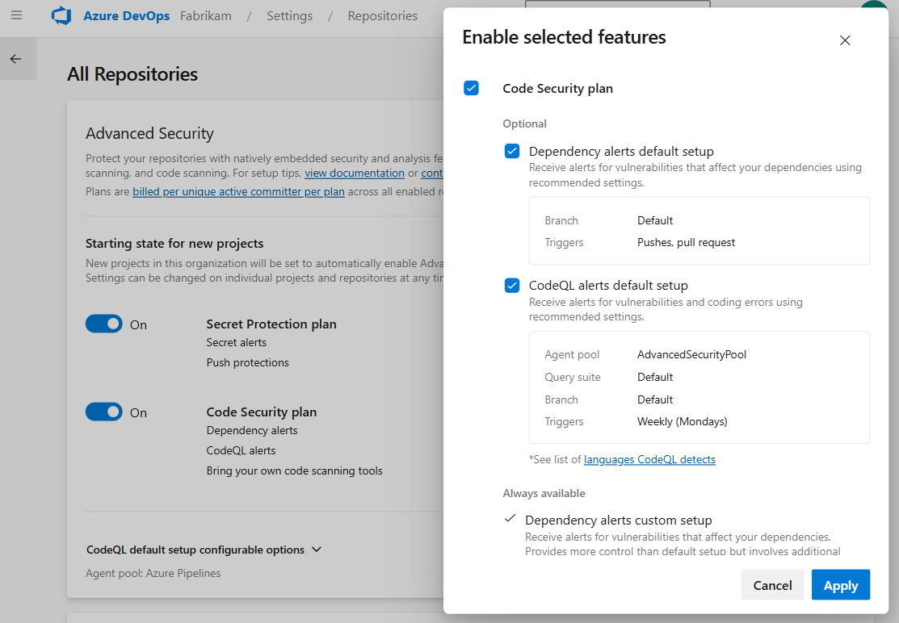
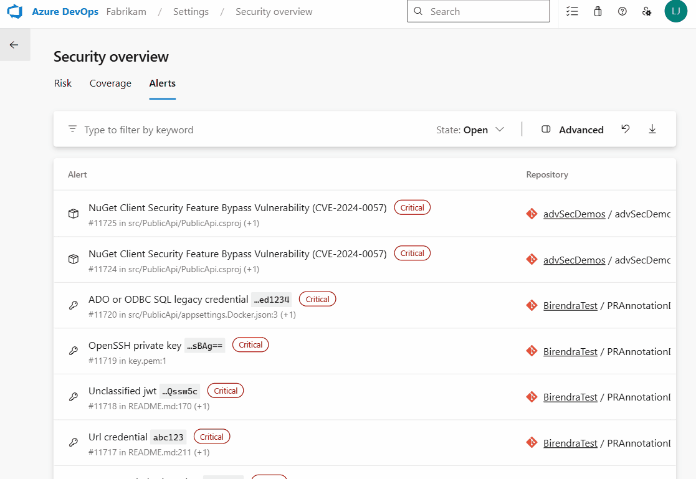
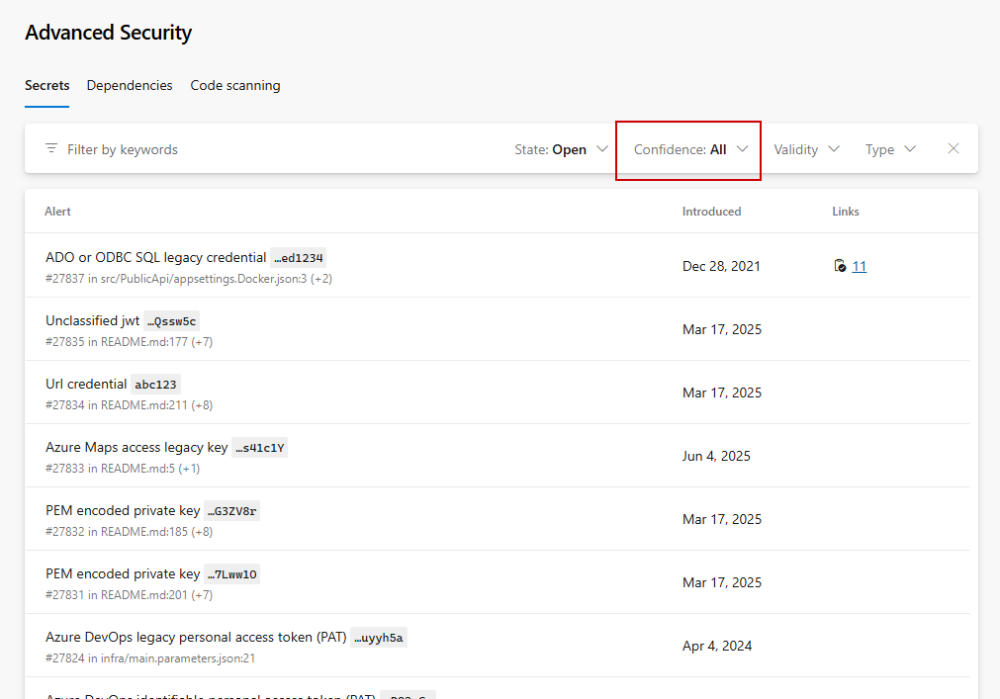

### CodeQL default setup for code scanning (public preview)

> [!IMPORTANT]
> **Update (May 1, 2026):** The rollout of CodeQL default setup has been delayed due to issues discovered during the rollout process. The team is actively working to resolve these issues and plans to resume rollout as soon as possible.

CodeQL default setup is now available in public preview for GitHub Advanced Security for Azure DevOps. With CodeQL default setup, you can enable code scanning for your repositories without any manual pipeline configuration. Once enabled, CodeQL automatically scans your code using Azure Pipelines and surfaces security vulnerabilities directly in your repository alerts.

To get started, enable CodeQL default setup from your organization, project, or repository settings. You can optionally configure or change the agent pool used for scanning through organization settings under **All Repositories**.

> [!div class="mx-imgBorder"]
> 

### Combined alerts view and security campaigns in security overview

Security overview now includes a combined alerts view, giving security administrators a single place to see and act on security alerts across all repositories in their organization. Instead of navigating to each repository individually, you can now search, filter, and prioritize alerts from one centralized dashboard.

Security campaigns let you create and share filtered views of alerts to coordinate remediation efforts across teams. Use filters to focus on specific vulnerability types, severity levels, or repositories, then share the view with your team.

> [!div class="mx-imgBorder"]
> 

### Alert UX enhancements: "All" confidence filter

We've added an "All" confidence filter that lets you see all secret alerts at once, without having to cycle through High and Other filters individually. "All" is now the default when you open the Secrets tab. This is a change only made in the UI - continue to use `High,Other` via API as needed to see all Confidences for secret alerts.

> [!div class="mx-imgBorder"]
> 