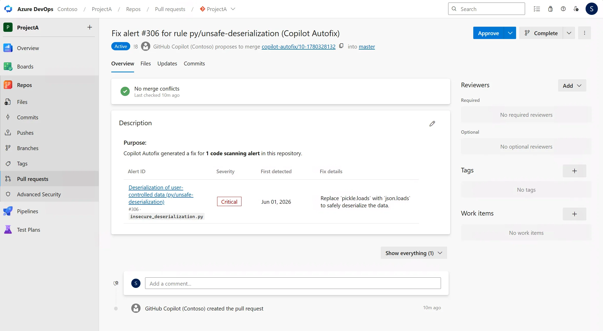

### GitHub Copilot Autofix for code scanning (limited public preview)

GitHub Copilot Autofix is now available in limited public preview for GitHub Advanced Security for Azure DevOps. Copilot Autofix analyzes CodeQL code scanning alerts and suggests targeted code fixes, automatically creating a pull request with a fix. Developers can review the suggested fix and merge the pull request, reducing the time spent remediating security vulnerabilities.

> [!div class="mx-imgBorder"]
>  

Organizations interested in participating can [sign up for the preview](https://nam.dcv.ms/VeDNq3VRhX) and, once approved, enable Copilot Autofix for their organization and repositories.

For more information, see [Copilot Autofix for code scanning](https://learn.microsoft.com/azure/devops/repos/security/github-advanced-security-code-scanning-autofix?view=azure-devops) (preview).

### CodeQL default setup rollout completed

The public preview rollout of CodeQL default setup for code scanning is now complete and available to all GitHub Advanced Security for Azure DevOps customers. By using CodeQL default setup, you can enable code scanning for your repositories without any manual pipeline configuration. Once enabled, CodeQL automatically scans your code by using Azure Pipelines and surfaces security vulnerabilities in your repository alerts.

To get started, see [Configure code scanning](https://learn.microsoft.com/azure/devops/repos/security/configure-github-advanced-security-features?view=azure-devops&pivots=standalone-ghazdo#set-up-code-scanning).

### Advanced Security status checks for pull requests (general availability)

Advanced Security status checks for pull requests are now generally available. Use the configurable `AdvancedSecurity/NewHighAndCritical` and `AdvancedSecurity/AllHighAndCritical` branch policies to block pull request completion when high or critical severity alerts are detected, helping your team prevent new vulnerabilities from reaching protected branches.

For more information, see [Configure status checks as branch policies](https://learn.microsoft.com/azure/devops/repos/security/configure-github-advanced-security-features?view=azure-devops#configure-status-checks-as-branch-policies).

### Build identity access to view alerts is being removed

Building on the change first introduced in [Sprint 269: Build identity access restricted for Advanced Security APIs](https://learn.microsoft.com/azure/devops/release-notes/2026/sprint-269-update#build-identity-access-restricted-for-advanced-security-apis-temporarily-reverted), we are completing the removal of the build identity service's permission to view Advanced Security alerts. This change rolls out starting July 1, 2026 and finishes July 15, 2026.

After the rollout completes, you can't use build service accounts to view alerts for pipeline gating. If your pipelines rely on the build service account to read alerts and gate builds, move to Advanced Security status checks, which give your team a native way to block pull request completion when new high or critical severity alerts are detected.

For next steps, see [Configure status checks as branch policies](https://learn.microsoft.com/azure/devops/repos/security/configure-github-advanced-security-features#configure-status-checks-as-branch-policies). For more background on this change, see [Build identities can access Advanced Security read alerts again](https://devblogs.microsoft.com/devops/temporary-rollback-build-identities-can-access-advanced-security-read-alerts-again/).
