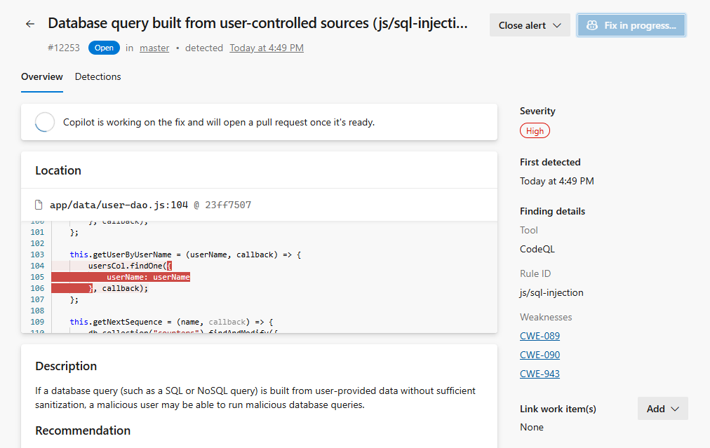

### View development dependency information on the Alerts page

For supported ecosystems, dependency scanning alerts now show whether an alert comes from a development dependency, so you can better prioritize and triage your dependency alerts. This information is currently available at the repository level. For more information, see [Supported package ecosystems](/azure/devops/repos/security/github-advanced-security-dependency-scanning-ecosystems).

### Copilot Autofix avoids empty branches and pull requests

When Copilot Autofix doesn't produce code changes to commit, it no longer leaves behind an empty branch or creates an empty pull request. This improvement reduces repository clutter from Autofix runs that don't generate a proposed fix.

### Copilot Autofix pull requests appear automatically in alert details

When Copilot Autofix creates a pull request for a CodeQL alert, the alert details now update automatically to show the pull request and continue to update once the pull request is complete. You no longer need to refresh the page to see that the suggested fix is ready for review.

> [!div class="mx-imgBorder"]
> 

### Copilot Autofix pull requests are easier to identify

Pull requests created by Copilot Autofix now use the `Copilot Autofix` tag instead of adding a suffix to the pull request title.
