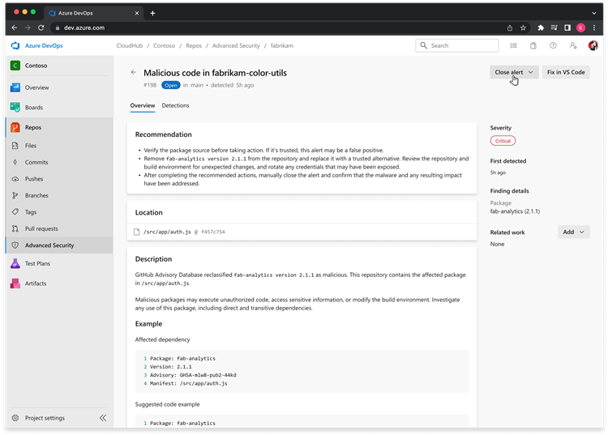
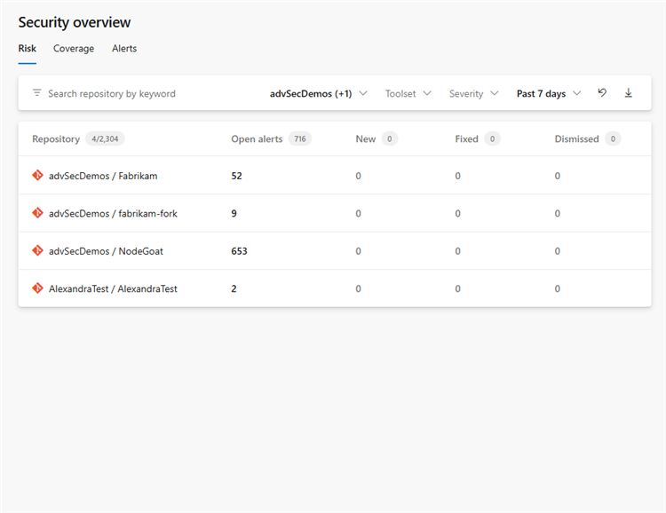
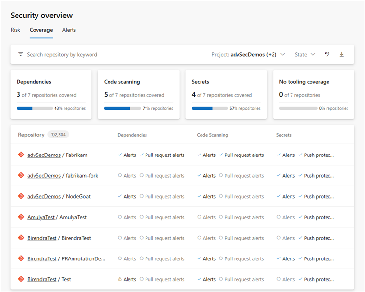

### Malware alerts (private preview)

GitHub Advanced Security for Azure DevOps can now surface malware findings as a distinct alert type in repository **Dependencies** and **Security Overview**. Security teams can filter, investigate, dismiss, and reopen these findings alongside their existing dependency alerts.

> [!div class="mx-imgBorder"]
> 

To request access for your organization, complete the [GitHub Advanced Security for Azure DevOps private preview intake form](https://aka.ms/ghazdo-private-preview).

### Security overview metrics (private preview)

Risk and coverage pages now include rollup metrics to help security teams understand alert exposure and scanning coverage across their organization. Teams can refine the metrics by project, repository, toolset, severity, period, and coverage state.

Risk:

> [!div class="mx-imgBorder"]
> 

Coverage:

> [!div class="mx-imgBorder"]
> 

To request access for your organization, complete the [GitHub Advanced Security for Azure DevOps private preview intake form](https://aka.ms/ghazdo-private-preview).

### Project-level billing for Autofix AI credit usage

Autofix AI credit usage is now attributed to individual Azure DevOps projects. In Azure Cost Management, you can break down Autofix usage and associated costs by project instead of seeing only an organization-level total. This makes it easier to understand and allocate Autofix consumption across your organization.
