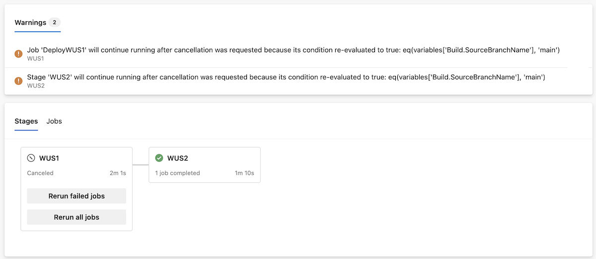
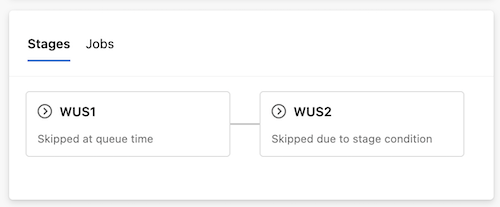

### Improved pipeline run debugging

In this sprint, we are improving your ability to debug pipeline runs.

It may happen that you need to cancel your run, but the job or stage continue to run, and you are confused. We've added warning messages to let you know when and why this is the case.

Imagine you have the following YAML:
```yaml
stages:
- stage: WUS1
  jobs:
  - job: DeployWUS1
    condition: eq(variables['Build.SourceBranchName'], 'main')
    steps:
    - task: CmdLine@2
      inputs:
        script: echo "Deploying $(System.StageName)"
    - task: CmdLine@2
      inputs:
        script: sleep 60
- stage: WUS2
  condition: eq(variables['Build.SourceBranchName'], 'main')
  jobs:
  - job: DeployWUS2
    steps:
    - task: CmdLine@2
      inputs:
        script: echo "Deploying $(System.StageName)"
```

Now, imagine you cancel the run when running job `DeployWUS1`. The job will continue to run, and so will stage `WUS2`. Azure Pipelines tells you why the job and the stage continue running.

> [!div class="mx-imgBorder"]
> [](../../media/269-pipelines-01.png#lightbox)

Another improvement we're bringing is letting you know why a stage is skipped.

Imagine you run the same YAML from a different branch, say, `release_123`, and you choose to only run stage `WUS2`. Previously, both `WUS1` and `WUS2` stages had the same status, `Skipped`, but it wasn't clear why each of the stages were skipped. Now, you know if the stage was skipped because you deselected it at queue run time or because of its runtime conditions.

> [!div class="mx-imgBorder"]
> [](../../media/269-pipelines-02.png#lightbox)