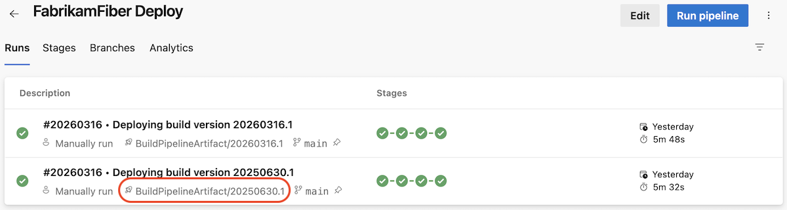
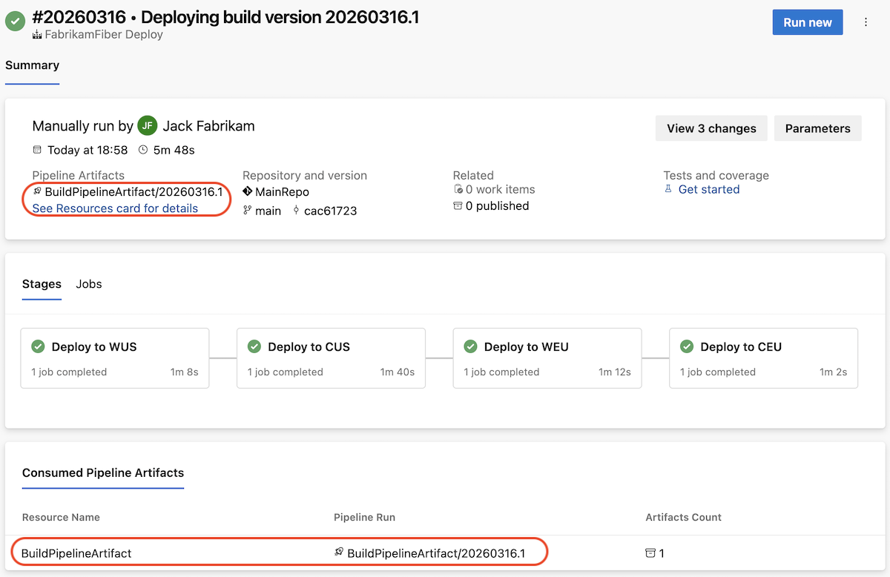
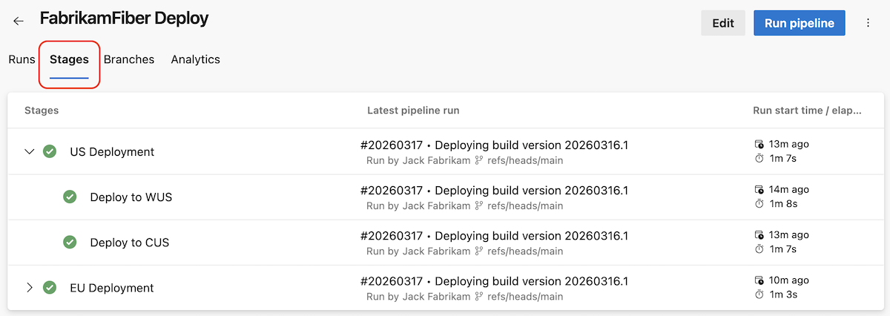
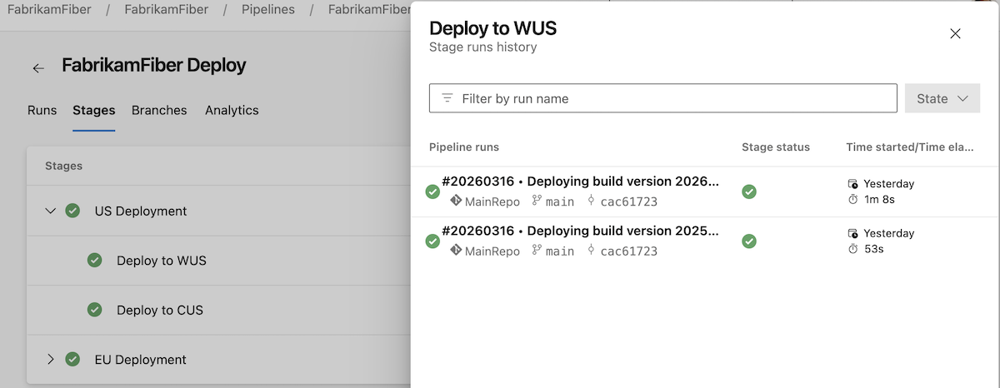
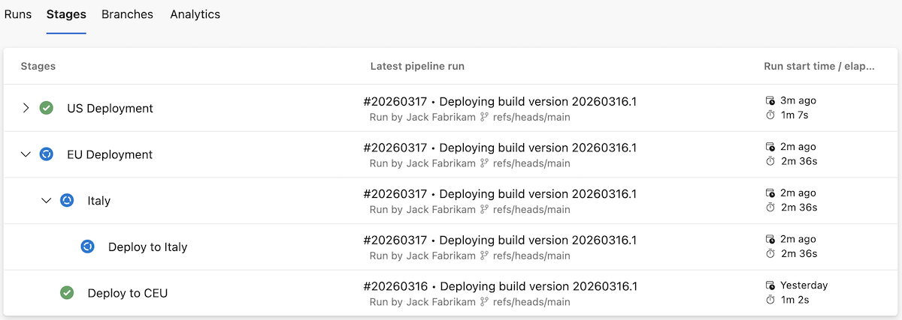

### Display the build artifact ID being deployed in a pipeline run

When using YAML Azure Pipelines for CD scenarios, it used to be hard to tell what artifacts were deployed.

With this sprint, we made it easier to identify artifacts used by a pipeline.

On a pipeline's runs overview page, we show you the artifact used by each run.

> [!div class="mx-imgBorder"]
> 

When viewing a single run, Azure Pipelines now first shows the artifacts used by that run.

> [!div class="mx-imgBorder"]
> 

This functionality works with pipeline artifacts you defined as pipeline resources. If you defined more than one artifact, Azure Pipelines picks the first one you defined.

### Deployment view per stage

When your deployment process requires deploying to multiple instances of your service, it becomes challenging to know what system version is deployed in which instance.

With this sprint, we've added a new functionality to Azure Pipelines called *Stages*. It works at pipeline level, and it shows you the currently deployed (or deploying) pipeline run for each stage in your pipeline.

Imagine you have the following YAML pipeline.

```yaml
stages:
- stage: deploy_WUS
  group: US Deployment
  displayName: Deploy to WUS
  jobs:
  - job:
    steps:
    - script: ./deploy.sh WUS
- stage: deploy_CUS
  group: US Deployment
  displayName: Deploy to CUS
  jobs:
  - job:
    steps:
    - script: ./deploy.sh CUS
- stage: deploy_WEU
  group: EU Deployment
  displayName: Deploy to WEU
  jobs:
  - job:
    steps:
    - script: ./deploy.sh WEU
- stage: deploy_CEU
  group: EU Deployment
  displayName: Deploy to CEU
  jobs:
  - job:
    steps:
    - script: ./deploy.sh CEU
```

After you ran your pipeline a couple of times, and you come to the *Stages* tab, this is what you see.

> [!div class="mx-imgBorder"]
> 

You can see that the latest run that touched the stage named "Deploy to WUS" was #20260317 that deployed the system version 20260316.1. For a stage, you see successful or in progress pipeline runs that run that stage.

If you click on the stage name, for example, "Deploy to WUS," you will get to the stage's logs. If you click on "#20260317 • Deploying build version version 20260316.1," you will get to that pipeline run.

If you click on the row of a stage, you get its deployment history. The history contains completed and in-progress runs that reference the stage.

> [!div class="mx-imgBorder"]
> 

Deployment pipelines can have hundreds of stages organized in various groups, for example, in a ring structure. We're adding support for specifying a stage's `group`. In the previous screenshot, you can see two groups, "US Deployment" and "EU Deployment."

The `group` stage property supports multiple levels of nesting. That is, you can have a group whose name reads `EU Deployment\Italy`, like in the following case.

```yaml
- stage: deploy_IT
  group: EU Deployment\Italy
  displayName: Deploy to Italy
  jobs:
  - job:
    steps:
    - script: echo ./deploy.sh IT
```

When you run this stage, the *Stages* view gets updated like in the following screenshot.


> [!div class="mx-imgBorder"]
> 

Stages are shown as long as there is a run that references them.

A stage needs to have a name to show up in the *Stages* tab. That is, `- stage: deploy_WUS` will show up, while `- stage:` will not.
