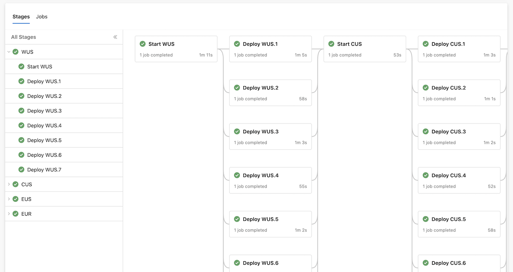
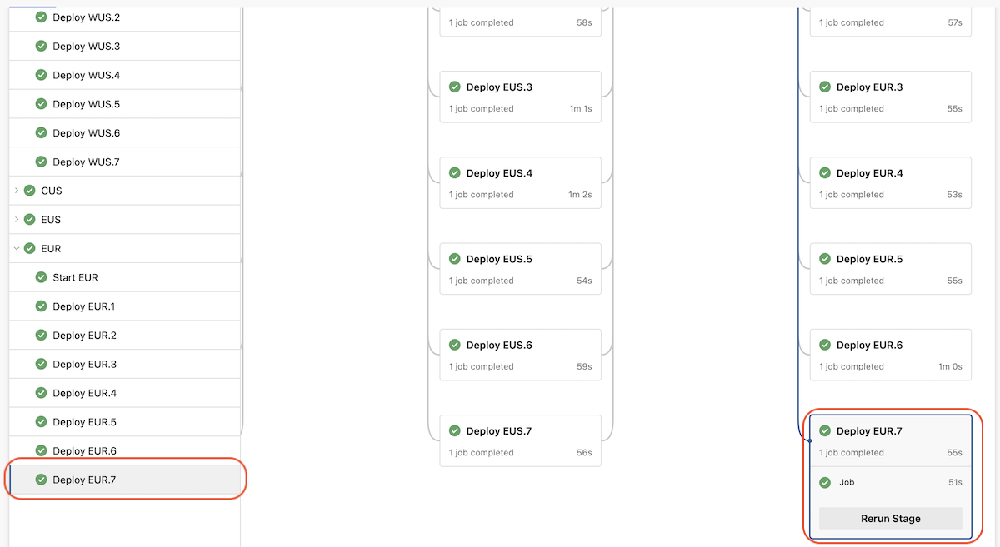
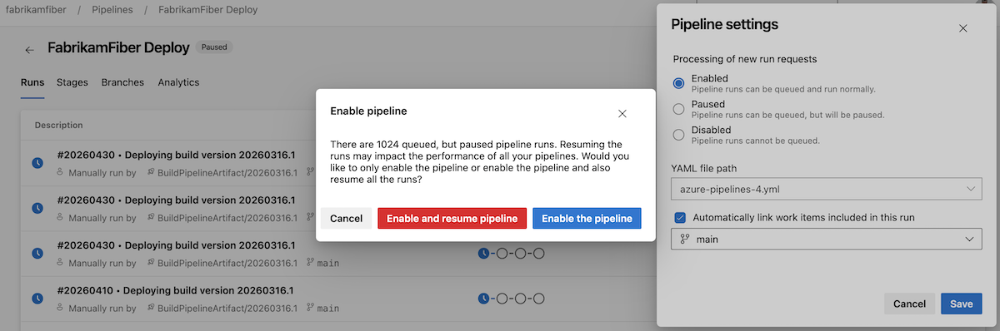

### Finer-grained comment requirement for running PR validation runs from GitHub repositories

To help protect your pipelines against unauthorized use, you can require comments from team members or contributors prior to running PR validation runs.

Before this sprint, the comment requirement applied for PRs from both within the repository and from forked repositories. To improve velocity, you may want to require team member comments only for PR validation runs originating from forked repositories. Alas, this was not possible.

Starting this sprint, you can configure comment requirements independently, per PR source. In the following example, comments are required only for PRs originating from repository forks.

> [!div class="mx-imgBorder"]
> 

### Faster pipeline stage navigation

Navigating complex CD pipelines is tedious. Such pipelines can have tens or even hundreds of stages. Knowing the state of each stage becomes more difficult as the pipeline progresses, because later stages don't fit on the screen.

Starting with this sprint, Azure Pipelines shows you a stage index on the left side of the stages map, making it easier to navigate to the stage you're interested in.

Imagine you have a pipeline with 32 stages, organized in a ring fashion. The stages in the last ring may not fit on screen. You may have to scroll down and right to get to the last stage.

> [!div class="mx-imgBorder"]
> 

With the stages side panel, navigation becomes easier. You can scroll vertically to the stage you're interested in and click on it to go to it.

> [!div class="mx-imgBorder"]
> 

### Enable pipeline and cancel paused runs

Enabling a paused or disabled pipeline can cause compute resource waste, when a large number of pipeline runs are resumed.

Starting with this sprint, when you enable a pipeline, you have the option to enable the pipeline but cancel the paused runs. The option to enable the pipeline and resume the runs is still available.

> [!div class="mx-imgBorder"]
> 
