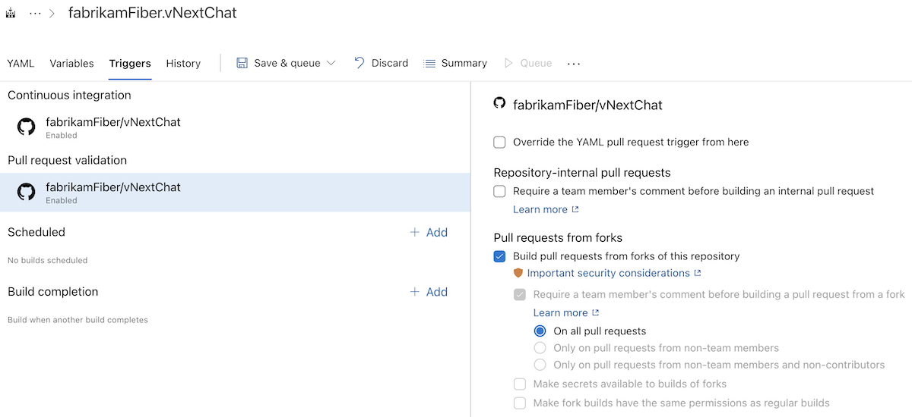

### Finer-grained comment requirement for running PR validation runs from GitHub repositories

To help protect your pipelines against unauthorized use, you can require comments from team members or contributors before pull request validation runs begin.

Before this sprint, the comment requirement applied to pull requests from both within the same repository and from forks. If you wanted to require team-member comments only for pull requests from forks, that wasn't possible.

Starting this sprint, you can configure comment requirements independently per pull request source. In the following example, comments are required only for pull requests that originate from repository forks.

> [!div class="mx-imgBorder"]
> 

### Access Azure DevOps with Microsoft Entra authentication

You can now use the new [Azure DevOps service connection](/azure/devops/pipelines/library/add-devops-entra-service-connection) to access Azure DevOps with a Microsoft Entra workload identity (service principal or managed identity) instead of personal access tokens (PATs) or session tokens.

Using Azure DevOps service connections helps improve pipeline security in several ways:

- Least privilege: Use scoped service connection permissions instead of broad shared [build service account permissions](/azure/devops/pipelines/process/access-tokens#scoped-build-identities)
- PAT-free authentication: Eliminate the need to create, store, and rotate [personal access tokens](/azure/devops/organizations/accounts/use-personal-access-tokens-to-authenticate)
- No persistent secrets: Use Microsoft Entra federated credentials instead of passwords
- Audit trail: Authentication attempts are logged in Azure DevOps audit logs

#### Configuring an Azure DevOps service connection

To create the Azure DevOps service connection, you first need to add a [service principal or managed identity](/azure/devops/integrate/get-started/authentication/service-principal-managed-identity) as a user to the organization and assign it permissions.

To create the service connection, choose **Azure DevOps (Preview)**:  

> [!div class="mx-imgBorder"]
> 

and select the service principal or managed identity you just created as the identity used:

> [!div class="mx-imgBorder"]
> 

You should assign the identity the permissions to the organization it needs. You can do this by following the **View access in the current organization** link and e.g. adding it to the Readers group of the current project.

> [!div class="mx-imgBorder"]
> 

#### Using the new Azure DevOps service connection

To check out a repository from a different organization:

```yaml
resources:
  repositories:
  - repository: external-repo
    type: git
    endpoint: my-azdo-connection
    name: 'external-project/external-repo'
    ref: 'refs/heads/main'

steps:
- checkout: self
- checkout: external-repo
```

To reference a YAML template from a different organization:

```yaml
resources:
  repositories:
    - repository: templates 
      type: git
      endpoint: my-azdo-connection
      name: 'external-project/external-repo'
      ref: "refs/heads/main"    
      
steps:
- template: azdosc-template.yml@templates

```
To access an artifacts feed using one of the authentication tasks:

```yaml
- task: NuGetAuthenticate@1
  inputs:
    nuGetServiceConnections: 'my-azdo-connection'

- task: DotNetCoreCLI@2
  inputs:
    command: 'restore'
    projects: '**/*.csproj'
```

#### Using the new Azure DevOps service connection in a script

The new `AzureCLI@3` task can be used to access Azure DevOps with Entra authentication in a number of ways. In all cases, you configure the service connection by setting `connectionType: 'azureDevOps'` and assigning `azureDevOpsServiceConnection` to an Azure DevOps service connection you created:

```yaml
- task: AzureCLI@3
  inputs:
    connectionType: 'azureDevOps'
    azureDevOpsServiceConnection: 'my-azdo-connection'
```

This creates an Entra ID authenticated session with the [Azure DevOps CLI](/azure/devops/cli):

```yaml
- task: AzureCLI@3
  displayName: Secret-less
  inputs:
    connectionType: 'azureDevOps'
    azureDevOpsServiceConnection: 'my-azdo-connection'
    scriptType: 'pscore'
    scriptLocation: 'inlineScript'
    inlineScript: |
      az devops configure -l

      az devops project list --query "value[].{Name:name, Id:id}" `
                            -o table

      az pipelines pool list --query "[].{Id:id, Name:name}" `
                            -o table

      az rest --method get `
              --url "https://status.dev.azure.com/_apis/status/health?api-version=7.1-preview.1" `
              --resource 499b84ac-1321-427f-aa17-267ca6975798 `
              --query "sort_by(services[?id=='Pipelines'].geographies | [], &name)" `
              -o table

```

If you do have a need for a token, for example you have an existing script where you use a PAT or `System.AccessToken` inline in script, there is also a method to obtain an Entra Access Token that can be used to access Azure DevOps:

```yaml
- task: AzureCLI@3
  displayName: Use Entra access token
  inputs:
    connectionType: 'azureDevOps'
    azureDevOpsServiceConnection: 'my-azdo-connection'
    scriptType: 'pscore'
    scriptLocation: 'inlineScript'
    inlineScript: |
      # Get access token for Azure DevOps
      $token = az account get-access-token --resource "499b84ac-1321-427f-aa17-267ca6975798" `
                                           --query "accessToken" `
                                           --output tsv
      
      # Use token in REST API call
      $headers = @{
        Authorization = "Bearer $token"
        "Content-Type" = "application/json"
      }
      
      $body = @{
        name = "Test Build"
      } | ConvertTo-Json
      
      Invoke-RestMethod -Uri "$(System.CollectionUri)$(System.TeamProject)/_apis/build/definitions?api-version=7.1" `
                        -Method POST `
                        -Headers $headers `
                        -Body $body
```

#### More information

For more information on how to configure the Azure DevOps service connection, see the [documentation](/azure/devops/pipelines/library/add-devops-entra-service-connection).

### Apple Silicon for macOS pipeline agents (pay-as-you-go preview)

We are making Apple Silicon macOS agents available in Azure Pipelines as a public preview. Starting with Apple Silicon, we will bring some of the same sizes available in GitHub Actions over to Azure Pipelines.

| Operating system | Hardware specification | Image | YAML VM image label | Pool |
| --- | --- | --- | --- | --- |
| macOS 26 | Standard | **macOS 26 arm64** | `macos-26-arm64` | GitHub-hosted Agents |
| macOS 26 | XLarge | **macOS 26 arm64 XL** | `macos-26-arm64-xl` | GitHub-hosted Agents |

These agents use Pay-as-you-Go pricing with a per-minute rate tied to the size of the agent, see [pricing](https://azure.microsoft.com/pricing/details/devops/azure-devops-services/).

To use the new agents, enable **GitHub-hosted agents** in billing settings:

> [!div class="mx-imgBorder"]
> 

This will provision the new **GitHub-hosted Agents** pool used for Pay-as-you-Go agents.

#### Using Apple Silicon images

Once provisioned, you can use the Apple Silicon `macos-26-arm64` image like this:

```yaml
pool:
  name: 'GitHub-hosted Agents'
  vmImage: 'macos-26-arm64'
steps:
- bash: |
    echo Hello from macOS Tahoe arm64
    uname -a
    sw_vers
```

And for the even more powerful `macos-26-arm64-xl` image like this:

```yaml
pool:
  name: 'GitHub-hosted Agents'
  vmImage: 'macos-26-arm64-xl'
steps:
- bash: |
    echo Hello from XL macOS Tahoe arm64
    uname -a
    hostinfo | grep memory
```

#### Monitoring per-minute usage

Pay-as-you-Go agents are charged per minute. To monitor the number of minutes used, the updated analytics tab of the **GitHub-hosted Agents** pool let's you view the number of minutes used per project, filter on image and drill down on Agent SKU and pipeline:

> [!div class="mx-imgBorder"]
> 

In Azure Cost Management you can track minutes used and break down the usage by Azure DevOps organization and project:

> [!div class="mx-imgBorder"]
> 

You can leverage Azure Cost Management support for [budgets and alerts](/azure/cost-management-billing/costs/cost-mgt-alerts-monitor-usage-spending) to forecast and monitor your spend.

#### More information

For more information on how to enable Apple Silicon agents and agent specifications, review the GitHub-hosted agents [documentation](/azure/devops/pipelines/agents/github-hosted).