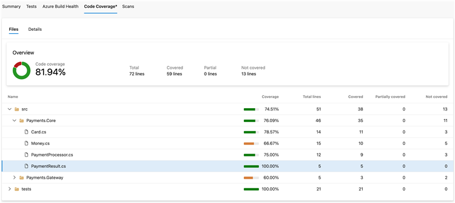
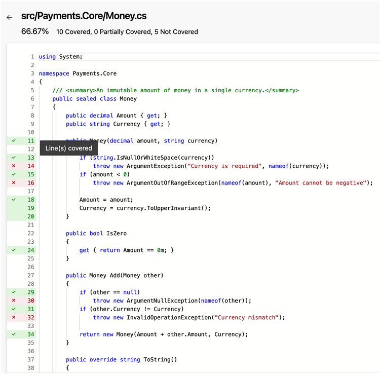
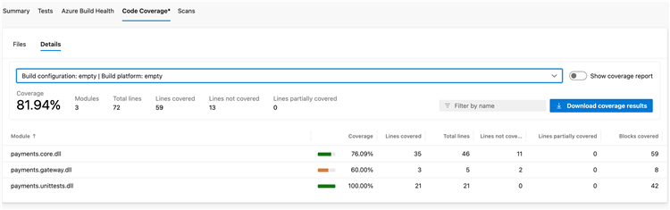
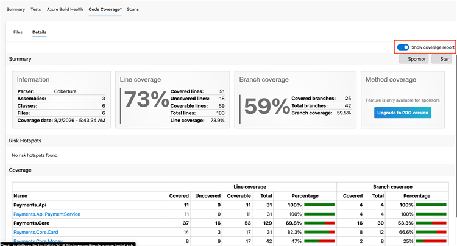

### Pipeline builds are moving to Microsoft Entra-issued access tokens

Pipeline builds are transitioning to authenticate with a Microsoft Entra-issued access token instead of an Azure DevOps-issued one. This change puts pipeline identity on the same platform that already governs the rest of your Microsoft cloud, with consistent issuance and validation and a single place where identity policy is applied and audited.

The change is transparent to pipelines: same builds, same authentication behavior, and no configuration to update. In the rare case that your pipeline decodes the build token and takes a direct dependency on its contents, that step might fail. If you have such a dependency, move it to the supported Azure DevOps REST APIs, as described in [Authentication Tokens Are Not a Data Contract](https://devblogs.microsoft.com/devops/authentication-tokens-are-not-a-data-contract/).

### Support for ARM64 with VSTest v3 task

The [VSTest v3](/azure/devops/pipelines/tasks/reference/vstest-v3) task now supports execution on Windows ARM64 agents. When running your pipelines on an ARM64 agent, the task automatically uses the native ARM64 `vstest.console` executable, allowing you to build and validate ARM64 applications and workloads more efficiently.

### Improved code coverage experience for Azure Pipelines

Azure Pipelines now has an enhanced code coverage experience that helps teams better understand coverage across complex builds, including multiconfiguration and multitarget-framework scenarios. Based on customer feedback, the new experience provides a clearer view of overall coverage while preserving the ability to drill into detailed results.

The new experience includes the following improvements:

- **Files view** provides code coverage at the folder and file level, including aggregated coverage across modules and build configurations, making it easier to understand overall project coverage.

  > [!div class="mx-imgBorder"]
  > 

- **Source code coverage visualization** lets you drill into individual files and quickly identify covered, partially covered, and uncovered code directly from the code coverage experience.

  > [!div class="mx-imgBorder"]
  > 

- **Details view** allows you to drill into configuration-specific and module-level coverage data when you need deeper insights.

  > [!div class="mx-imgBorder"]
  > 

- **HTML coverage reports** remain available through the **Show coverage report** toggle, allowing you to switch to the full report experience when you need more advanced coverage analysis.

  > [!div class="mx-imgBorder"]
  > 

This experience is available for supported VSTest and Publish Code Coverage Results v2 coverage scenarios.