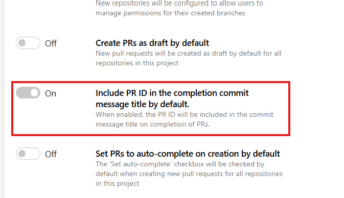
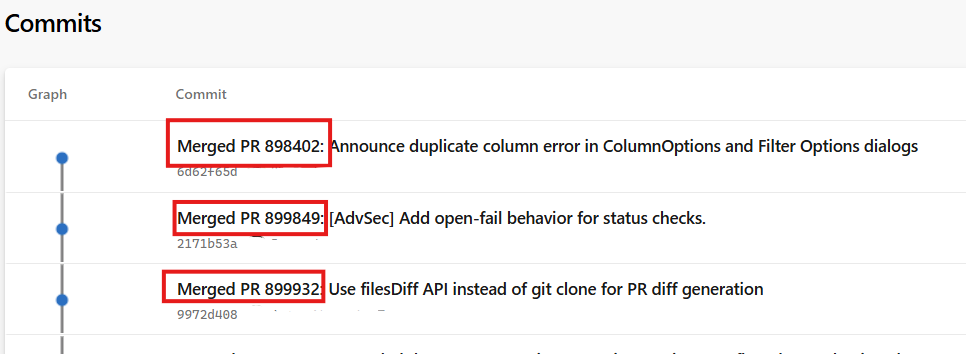

### Auto-complete pull requests by default

We’ve added a new repository setting: **Set PRs to auto-complete on creation by default**.

> 

This setting controls the default state of the **Set auto-complete** toggle for newly created pull requests.

When this setting is enabled, every new PR will automatically have Set auto-complete turned on.
When it’s disabled, new PRs will start with Set auto-complete turned off, and authors can choose to enable it manually.

> 

To turn on this setting, go to **Project settings → Repositories → Settings**. You can enable it for the entire project so all repositories use the same configuration, or update it directly within an individual repository’s settings.

### New repository setting for pull request ID in commit messages

We have introduced a new repository level setting that allows teams to control whether the pull request (PR) ID is automatically prefixed to commit messages generated during PR completion.

> 

Previously, commit messages created during PR completion always included the PR ID at the beginning of the message. With this update, repository administrators can choose whether this prefix is included.

>  

By default, the setting remains enabled to preserve existing behavior. When enabled, commit messages generated during PR completion will continue to include the PR ID prefix. When disabled, commit messages created during PR completion will no longer include the PR ID.

This setting applies only to commits generated during PR completion actions such as merge, squash, or rebase. It does not affect manual commits and only applies to commits created after the setting is changed.

This is feature is addressing a [Developer Community suggestion ticket](https://developercommunity.visualstudio.com/t/change-default-title-for-pull-request-commits-to-n-1/365716).