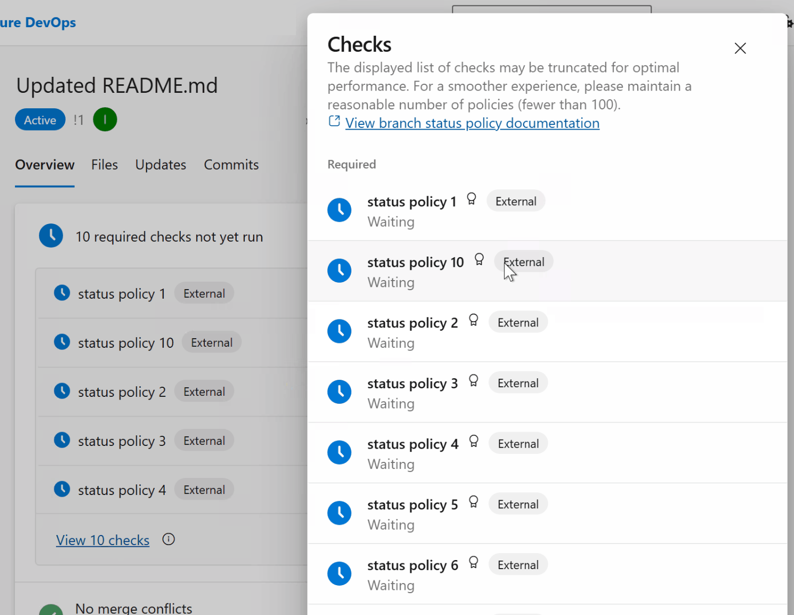
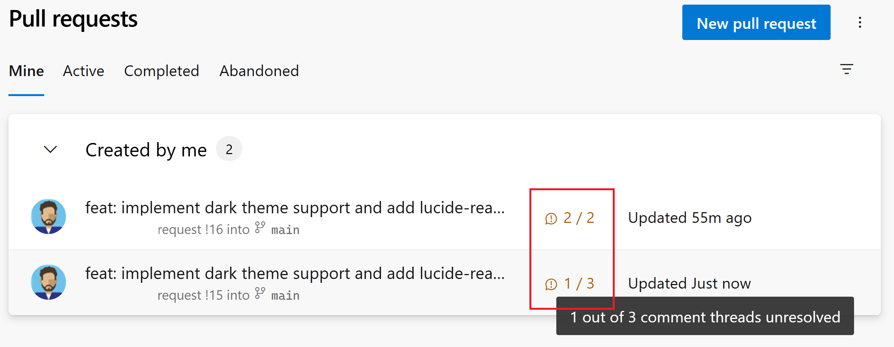

### Improvements to pull request status checks

We added a new **External** badge to pull request status checks to help you distinguish custom third-party status policies from built-in Azure DevOps branch policies. Previously, external policies looked identical to standard policies like builds or required reviewers, which often caused confusion when a pull request was blocked.

With this update, external status policies are now clearly labeled in the checks experience, and hovering over the badge provides additional details about the policy owner and that it's managed outside of standard branch policies. This helps authors and reviewers quickly understand why a pull request is blocked and resolve issues faster.

> [!div class="mx-imgBorder"]
> 

### Show unresolved comments on pull request list

We now highlight pull requests that contain unresolved comment threads directly in the pull request list view.

This gives authors and reviewers quick visibility into whether a pull request still needs attention before it can be completed or merged. Instead of opening each pull request to check discussion status, you can immediately see if there are outstanding review comments that still need to be addressed.

The unresolved comment indicator displays the number of unresolved threads alongside the total number of comment threads (for example, **1 / 3**), making it easier to understand review progress at a glance.

> [!div class="mx-imgBorder"]
> 

### Git object count limit removed

The hard limit on the number of Git objects in a repository has been removed. Previously, repositories were capped at 100 million objects, which could be a constraint for very large and active codebases. With this change, repositories can grow without an object count ceiling, improving scalability and longevity.

This especially benefits long-lived, large monorepos with extensive history, a huge number of contributors, and continuous development at scale.
