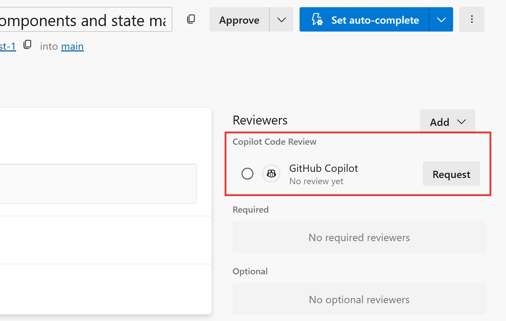
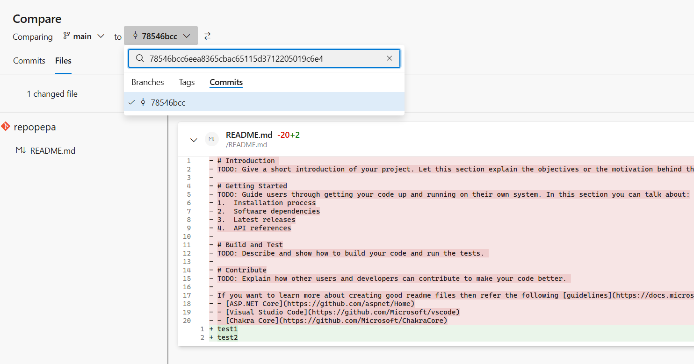

### Copilot code reviews for Azure Repos (limited public preview)

GitHub Copilot can now review pull requests directly in Azure Repos. When a pull request is ready for review, developers can request a Copilot review to analyze proposed changes and identify potential bugs, code quality issues, and maintainability concerns.

Feedback is provided directly in the pull request, helping teams catch issues earlier and improve code quality before merging.

> [!div class="mx-imgBorder"]
> 

This feature is available through a limited public preview. Organizations interested in participating can [sign up for the preview](https://nam.dcv.ms/VeDNq3VRhX) and, once approved, enable Copilot Code Reviews for their organization and repositories.

### Enable commit comparison in branch compare page

You can now search for and select commits by SHA directly from the version picker on the branch compare page.

Previously, comparing commits required manually constructing a URL. With the new **Commits** tab in the version picker, commit-to-commit and branch-to-commit comparisons are available directly in the UI.

> [!div class="mx-imgBorder"]
> 
