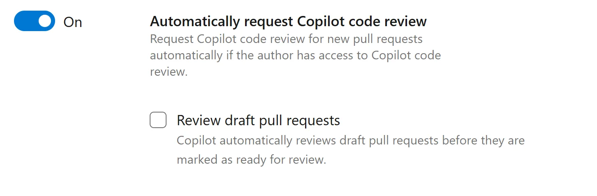
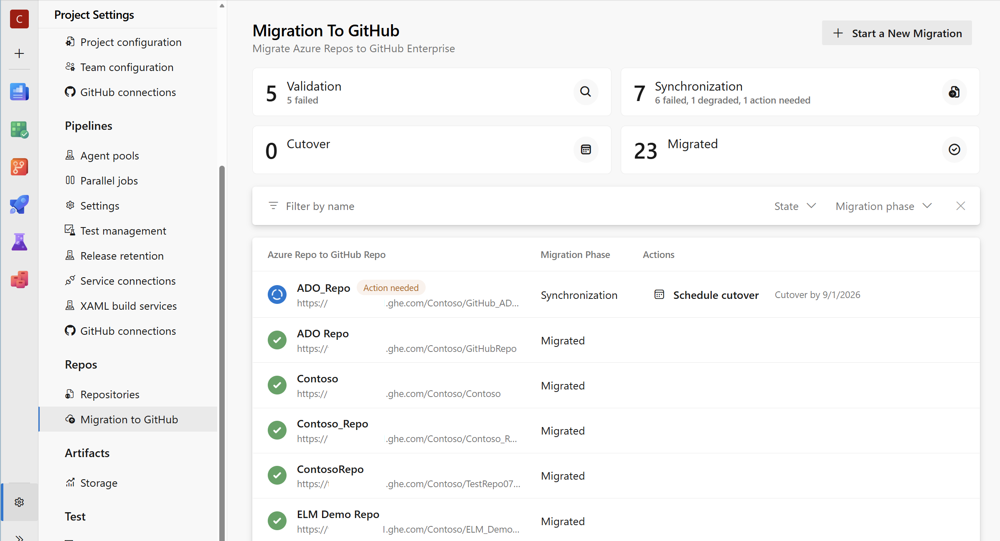

### GitHub Copilot Code Review (public preview)

GitHub Copilot Code Review for Azure Repos is now in public preview and available to all Azure DevOps customers, with no early-access signup required. Copilot Code Review brings AI-powered feedback directly into the pull request workflow, helping teams identify issues and apply coding standards more consistently.

> [!div class="mx-imgBorder"]
> 

Before getting started, [read the official documentation](/azure/devops/repos/git/copilot-code-reviews) for details on how Copilot Code Review works, how to enable it, and what to expect around usage and billing.

The public preview also introduces several enhancements based on feedback from the technical preview:

- **Flexible enablement**: Enable Copilot Code Review at the organization, project, or individual repository level.
- **Managed DevOps Pools support**: Run reviews using a configured Managed DevOps Pool instead of Microsoft-hosted agents.
- **Custom instructions**: Define organization, project, repository, or path-specific coding standards for Copilot to consider during reviews.
- **Automatic reviews**: Use branch policies to automatically review new pull requests, including draft pull requests.
- **Improved cost visibility**: Track Copilot Code Review costs by Azure DevOps project using Azure Cost Management tags and budget alerts.
- **Coming soon**: Review failure logs and configurable **Lite** and **Balanced** review levels.

### Azure DevOps Enterprise Live Migrations (public preview)

Azure DevOps Enterprise Live Migrations is now in public preview. Enterprise Live Migrations helps organizations move repositories from Azure DevOps to GitHub Enterprise Cloud with data residency while minimizing developer disruption through continuous synchronization and a controlled cutover process. It supports migration of repository history, branches, tags, pull request metadata, and branch policies, while enabling teams to continue using Azure Pipelines and Azure Boards during their transition. [Learn more about Enterprise Live Migrations](https://aka.ms/adoELM).

> [!div class="mx-imgBorder"]
> 

### Automatic titles for multi-commit pull requests

When creating a pull request with multiple commits, the pull request title is now automatically populated using the source branch name. This provides a useful default instead of leaving the title empty.

The existing **Add Commit Messages** option remains available for adding commit messages to the pull request description.