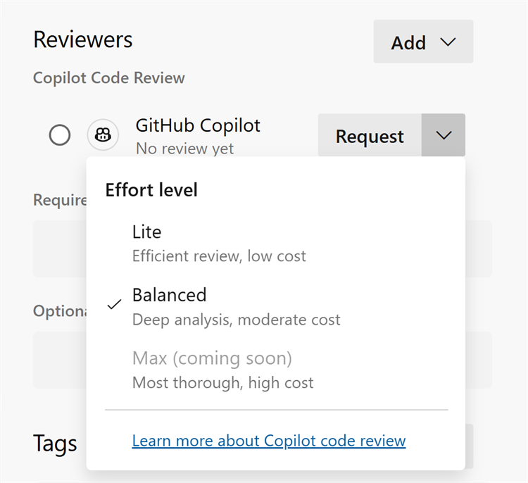
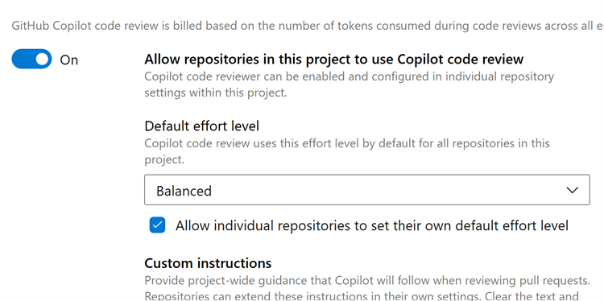

### Effort level configuration for Copilot code reviews (public preview)

If you use GitHub Copilot Code Review with Azure Repos, you can now select the effort level for a code review.

The effort level controls how much time Copilot spends reviewing a pull request. This gives you more control over the review and can help reduce costs for pull requests that don't require an in-depth code review.

> [!div class="mx-imgBorder"]
> 

You can also configure the default effort level as **Lite** or **Balanced** at the project or repository level. Project administrators can set the default across all repositories in a project, while individual repositories can have their own default when needed.

> [!div class="mx-imgBorder"]
> 

This gives teams the flexibility to choose the appropriate level of review based on their needs.

If you aren't yet using GitHub Copilot Code Review for Azure Repos, learn more about the feature and how to get started in our [public preview announcement](https://devblogs.microsoft.com/devops/copilot-code-reviews-for-azure-repos-public-preview/).

### Reliability improvements for pull request status checks

We fixed a rare issue that could cause a pull request's status checks to fail to load, both in the web experience and when retrieving them through the REST API. When this issue happened, requests to read a pull request's statuses could return an error, which could block the pull request from being completed and disrupt automation or integrations that rely on status checks.

With this update, pull request statuses load reliably again, so checks and branch policies evaluate correctly, completion works as expected, and tools reading statuses through the API no longer hit the error. No action is needed, affected pull requests recover automatically.