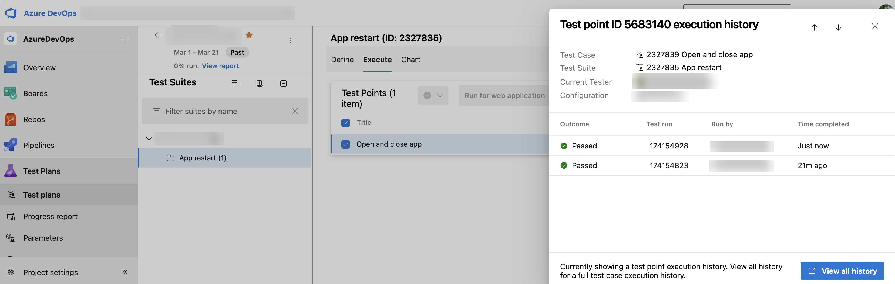

### New Test Run Hub

We are excited to announce that the new Test Run Hub is gradually going generally available for all Azure DevOps organization! You can now select and copy information from any page within the Test Run Hub user interface. In addition, we have included the following features and updates:
* For automated test runs, the stack trace component has been enhanced to provide improved readability of the full stack trace
* Images captured during test execution can now be previewed inline on each test result page
* Search functionality logic for runs using the **Run Title** now matches run titles that start with your search term
* Run Summary page usability and readability have been improved with updated minimum and default column width configurations
* You can now link work items to test runs across different projects
* You can now go directly from a pipeline logs to the specific run summary, saving you time and eliminating extra navigation steps
* For automated runs, all sub result attachments are now visible on each test result page, making it easier for you to review detailed outcomes
* Time and date values are now displayed according to your selected time and locale format
* Search by Run ID within a project, independent of other filters
* Copy text from any screen in the new Test Run Hub for easier sharing and productivity boost
* Optimized column widths in the test results table for improved readability
* Enhanced stack trace preview for automated runs to make analysis straight forward
* Search test runs across a 90-day timeframe from any point in time
* Added test **Owner** and **Last Updated** columns for better tracking
* All attachments of automated sub-runs are now available in the UI as expected
* Fixed an issue where test cases created during exploratory sessions were not correctly linked to the original test case.

### Improved test case import wizard

We've improved the test case import wizard to help boost your productivity. It includes enhanced auto‑mapping, reusable mapping templates that can be shared across teams, and additional improvements to streamline imports.For details, see the import test cases public documentation [here](/azure/devops/test/bulk-import-export-test-cases?view=azure-devops#import-test-cases).

### Focused test point history panel

Previously, you had no easy way to see point-specific history from the Test Plans page, making it hard to differentiate among test points in result history. 

Now, you can view execution history for individual test points directly from the Test Plans page. In addition, you can select **View all history** to review the complete execution history for the associated test case.

> [!div class="mx-imgBorder"]
> 

### Recent test result in user story

Get real-time updates on test progress directly within the user story work item. You can now see a snippet of the most recent test case result in the Related Work section, showing key details like the outcome and completion time without needing extra navigation. This update brings consistency between the Boards view and user stories, making it faster and easier to track test progress at a glance. These improvements aim to enhance traceability and streamline your workflow, helping you stay focused on what matters most.

### Resume is now the default action for paused test cases 

With the enhanced **Resume Paused Test Case** experience, **Resume** is now the default action for all paused manual test flows, making it easy to continue where you left off. If you attempt a different action, you’ll see a clear warning to help prevent accidental progress loss and ensure a smoother testing experience.