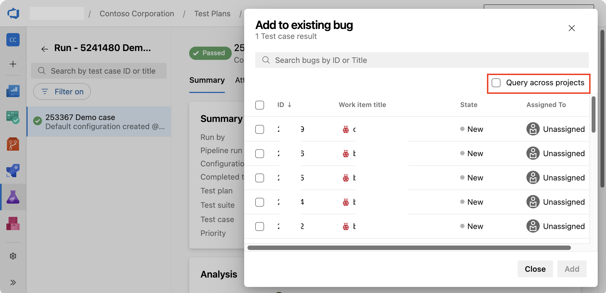
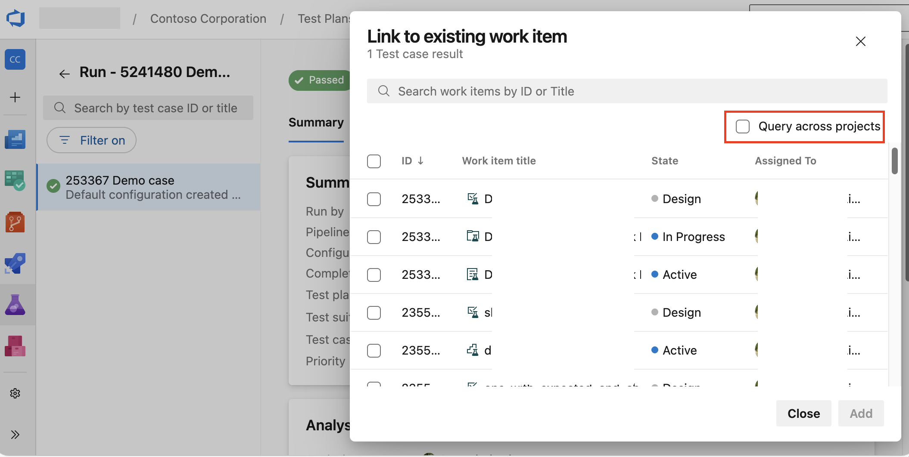

### Test results - option to query and relate work items from different projects

If you need to search for and relate a bug or a work item to your test result, and the specific work item exists in a different project than your test result, make sure to enable the "Query across projects" option first.

> [!div class="mx-imgBorder"]
> 

- Relating bugs

> [!div class="mx-imgBorder"]
> 

- Relating work items
