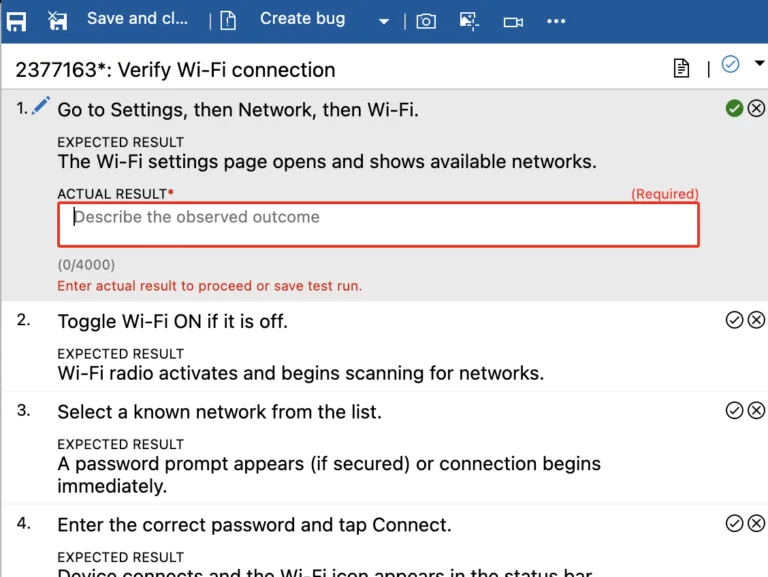

### Public preview: Capture actual result per step in manual test runs

This feature has been one of the top [requests](https://developercommunity.visualstudio.com/t/actual-result-field-needed-in-test-results-test-pl/890708) from the community, and we're thrilled to make it available.

You can now record the **Actual Result** for each step during manual test execution in Azure Test Plans. This captures the factual outcome of each step alongside Pass/Fail, giving you structured evidence of what happened during the run, useful for audits, triage, and defect reporting.

The feature is configured per test plan, with three modes:

- **Disabled** (default): The field is hidden and inactive.
- **Enabled - Optional**: The field appears; entry isn't enforced.
- **Enabled - Required**: Testers must enter an actual result for every step that has a defined expected result before they can proceed.

> [!div class="mx-imgBorder"]
> 

Learn more in the [Actual Result documentation](/azure/devops/test/actual-result?view=azure-devops&preserve-view=true).

The feature is in **public preview** and your input is crucial. Please share your experiences, suggestions, and any issues you may encounter. You can send feedback directly via the Azure DevOps [Developer Community](https://developercommunity.visualstudio.com/AzureDevOps) or email us at *azdo-testplans-uxr @ microsoft.com* (remove the spaces).
