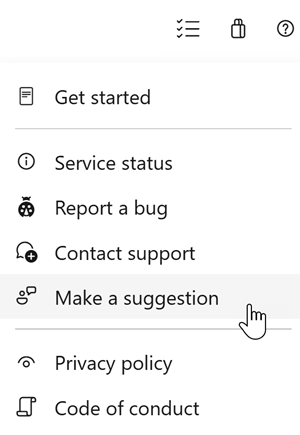

# Retirement of Global Personal Access Tokens (PATs) in Azure DevOps

As announced in our Azure DevOps blog post, [Retirement of Global Personal Access Tokens in Azure DevOps](https://devblogs.microsoft.com/devops/retirement-of-global-personal-access-tokens-in-azure-devops/), we are retiring the Global Personal Access Token (PAT) type to strengthen security. Global PATs provide access across all organizations a user belongs to, resulting in an overly broad credential with elevated risk. To better align with modern security practices, Azure DevOps is shifting away from global, full‑scoped tokens toward authentication approaches that are more scoped, controlled, and governable.

Customers and internal teams should assess any workflows or integrations that depend on global PATs and begin transitioning to supported alternatives. Where required, this includes moving to organization‑scoped PATs or adopting Microsoft Entra–based authentication. This transition reduces blast radius, improves credential governance, and supports Azure DevOps’ alignment with Microsoft’s broader security strategy.

Check out the release notes for details.

### General
[!INCLUDE [sprint-270-update-links](includes/general/sprint-270-update-links.md)]

### Boards
[!INCLUDE [sprint-270-update-links](includes/boards/sprint-270-update-links.md)]

### Test Plans
[!INCLUDE [sprint-270-update-links](includes/testplans/sprint-270-update-links.md)]

## General
[!INCLUDE [sprint-270-update](includes/general/sprint-270-update.md)]

## Boards
[!INCLUDE [sprint-270-update](includes/boards/sprint-270-update.md)]

## Test Plans
[!INCLUDE [sprint-270-update](includes/testplans/sprint-270-update.md)]

## Next steps

> [!NOTE]
> These features will roll out over the next two to three weeks.
Head over to Azure DevOps and take a look.

> [!div class="nextstepaction"] 
> [Go to Azure DevOps](https://go.microsoft.com/fwlink/?LinkId=307137&campaign=o~msft~docs~product-vsts~release-notes)
## How to provide feedback

We would love to hear what you think about these features. Use the help menu to report a problem or provide a suggestion.

> [!div class="mx-imgBorder"] 
> 

You can also get advice and your questions answered by the community on [Stack Overflow](https://stackoverflow.com/questions/tagged/azure-devops).