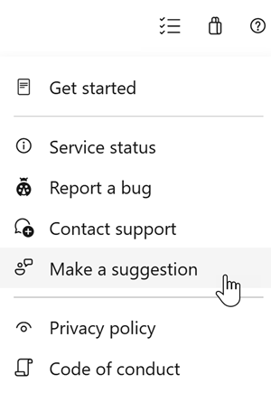

# Azure DevOps remote MCP Server generally available and new audit events

In this sprint, the Azure DevOps Remote MCP Server is now generally available, with expanded support for Microsoft Foundry and Copilot Studio. In addition, we've expanded auditing to provide greater visibility into administrative and security-related activities. New audit events now track service hook changes and licensing updates, while audit streaming to Azure Monitor logs now uses Microsoft Entra-based authorization to improve security and align with modern authentication practices.

Check out the release notes for details.

### General
[!INCLUDE [sprint-278-update-links](includes/general/sprint-278-update-links.md)]

### Azure Pipelines
[!INCLUDE [sprint-278-update-links](includes/pipelines/sprint-278-update-links.md)]

### Wiki
[!INCLUDE [sprint-278-update-links](includes/wiki/sprint-278-update-links.md)]

## General
[!INCLUDE [sprint-278-update](includes/general/sprint-278-update.md)]

## Azure Pipelines
[!INCLUDE [sprint-278-update](includes/pipelines/sprint-278-update.md)]

## Wiki
[!INCLUDE [sprint-278-update](includes/wiki/sprint-278-update.md)]

## Next steps

> [!NOTE]
> These features will roll out over the next two to three weeks.
Go to Azure DevOps and take a look.

> [!div class="nextstepaction"]
> [Go to Azure DevOps](https://go.microsoft.com/fwlink/?LinkId=307137&campaign=o~msft~docs~product-vsts~release-notes)

## How to provide feedback

We want to hear what you think about these features. Use the help menu to report a problem or provide a suggestion.

> [!div class="mx-imgBorder"]
> 

You can also get advice and your questions answered by the community on [Stack Overflow](https://stackoverflow.com/questions/tagged/azure-devops).
