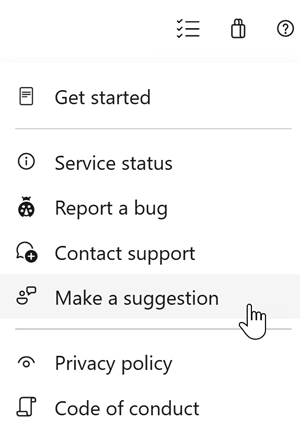

# Copilot Autofix now uses an agentic foundation and repository context

In this sprint, Copilot Autofix adds agentic capabilities and repository context. We're also introducing EPSS data to help prioritize dependency alerts, configurable Copilot code review effort levels, more reliable pull request status checks, and multi-target framework code coverage.

Check out the release notes for details.

### GitHub Advanced Security for Azure DevOps
[!INCLUDE [sprint-280-update-links](includes/ghazdo/sprint-280-update-links.md)]

### Azure Repos
[!INCLUDE [sprint-280-update-links](includes/repos/sprint-280-update-links.md)]

### Azure Test Plans
[!INCLUDE [sprint-280-update-links](includes/testplans/sprint-280-update-links.md)]

## GitHub Advanced Security for Azure DevOps
[!INCLUDE [sprint-280-update](includes/ghazdo/sprint-280-update.md)]

## Azure Repos
[!INCLUDE [sprint-280-update](includes/repos/sprint-280-update.md)]

## Azure Test Plans
[!INCLUDE [sprint-280-update](includes/testplans/sprint-280-update.md)]

## Next steps

> [!NOTE]
> These features will roll out over the next two to three weeks.
Go to Azure DevOps and take a look.

> [!div class="nextstepaction"]
> [Go to Azure DevOps](https://go.microsoft.com/fwlink/?LinkId=307137&campaign=o~msft~docs~product-vsts~release-notes)

## How to provide feedback

We want to hear what you think about these features. Use the help menu to report a problem or provide a suggestion.

> [!div class="mx-imgBorder"]
> 

You can also get advice and have your questions answered by the community on [Stack Overflow](https://stackoverflow.com/questions/tagged/azure-devops).
