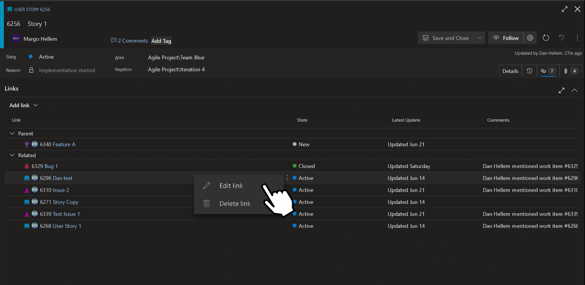

# Ability to change link type from Web UI

As a user, it takes me 5 steps to change a link type. I want to change a link type in the UI with in only one step.

> [!div class="mx-imgBorder"]
> 

> [!NOTE]
> This feature will only be available with the [**New Boards Hubs** preview](https://devblogs.microsoft.com/devops/new-boards-hub-public-preview/).