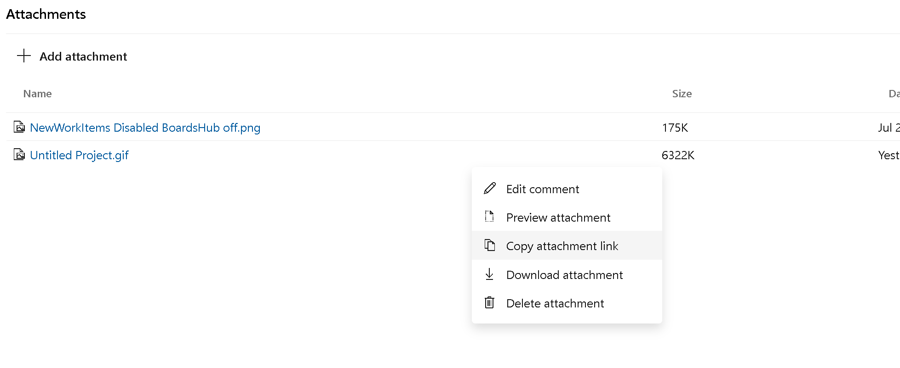

# Copy work item attachment url

As a user, I want to copy the URL for a work item attachment so that it can be cut and pasted in the description and discussions. Then when you click on the link, it will download the attachment.

> [!div class="mx-imgBorder"]
> 

> [!NOTE]
> This feature will only be available with the [**New Boards Hubs** preview](https://devblogs.microsoft.com/devops/new-boards-hub-public-preview).