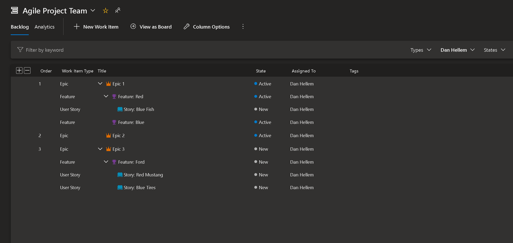

 
# Maintain backlog hierarchy when filters are applied

As a user, I want to maintain my tree view even when I filter my backlog so that I don't lose context of the work I'm trying to organize.

> [!div class="mx-imgBorder"]
> 

> [!NOTE]
> This feature will only be available with the [**New Boards Hubs** preview](https://devblogs.microsoft.com/devops/new-boards-hub-public-preview/).

[Community suggestion ticket](https://developercommunity.visualstudio.com/t/boards-backlogs-please-keep-displaying-the-hierarc/366475)