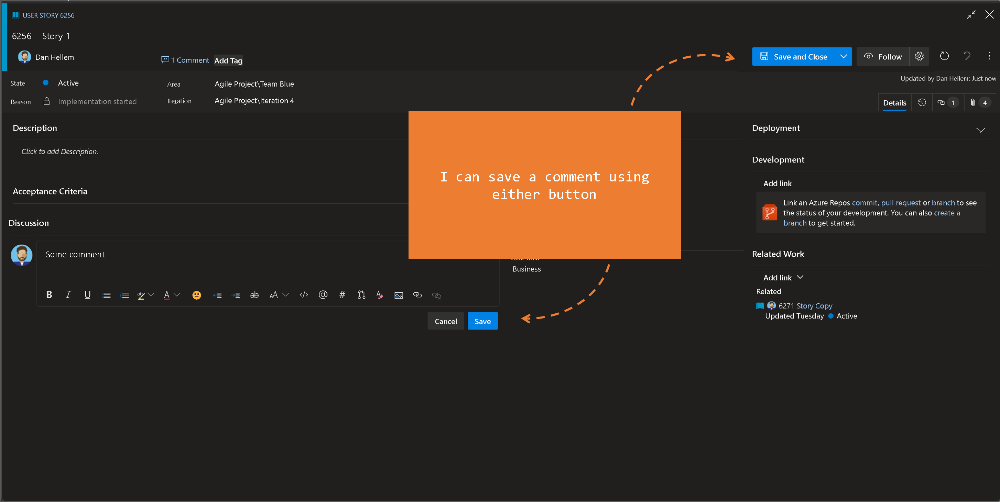

# Save Comment Improvements

In my project, there are some users who only need to contribute to discussions. They should not update any other fields. 

As a user, when I save a discussion, the entire work item (and run work item rules) should not be saved.

> [!div class="mx-imgBorder"]
> 

[Community suggestion ticket](https://developercommunity.visualstudio.com/t/separate-rights-for-work-item-discussion/365819)