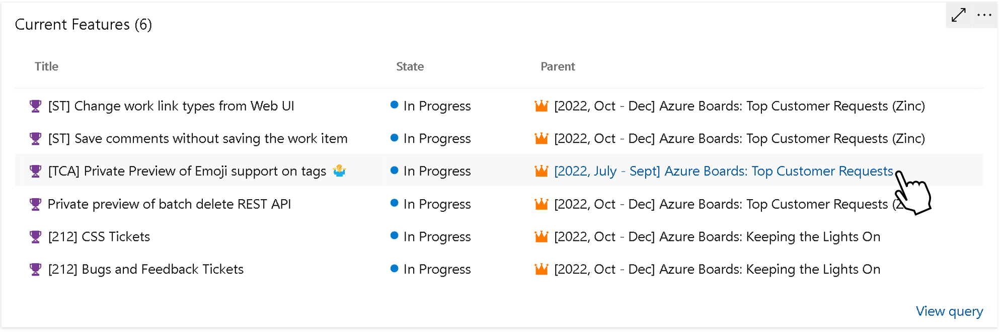

# Show Link with Parent Name in Query Results Widget

The Query Results Widget should a show a link to the parent item is displayed with an icon showing the work item type

> [!div class="mx-imgBorder"]
> 

[Community suggestion ticket](https://developercommunity.visualstudio.com/t/query-results-widget-show-link-with-name-of-parent/819009)