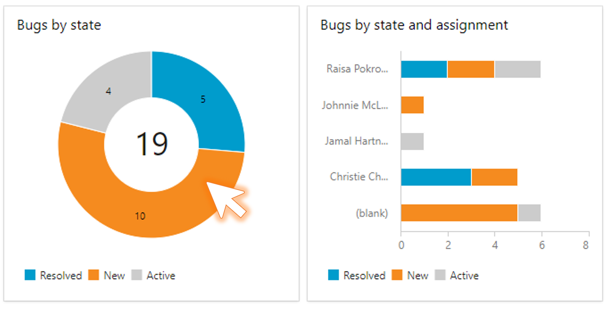

# Chart click thru to results by section

As a user, when I click on a section of a work item chart, I want to see the query results just for that section. For example: When looking at the **Bugs by State** chart, when I click on the New section, that would load a query to display just the New work items.

> [!div class="mx-imgBorder"]
> 

[Community suggestion ticket](https://developercommunity.visualstudio.com/t/clicking-a-graph-or-chart-section-should-display-s-1/526855)