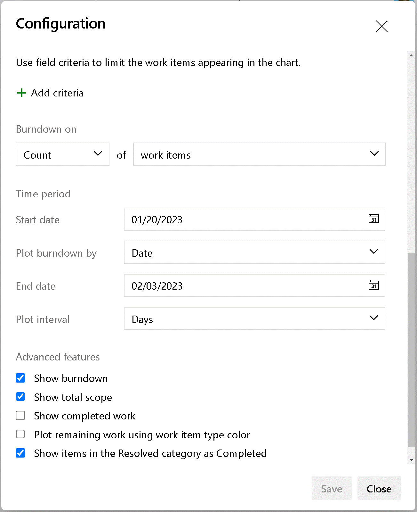

# Option to include Resolved as Completed

As a team, we would like the option for the Burndown, Burnup, and Velocity charts to take into account that work items in the **Resolved** state are completed. Currently, those charts look at resolved items as work that are still in progress. 

[Community Suggestion Ticket](https://developercommunity.visualstudio.com/t/allow-burnupburndown-charts-to-include-resolved-wo/578309)

Charts affected are:

- Burndown widget
- Burnup widget
- Sprint Burndown widget
- Sprint Burndown on Analytics tab
- Velocity widget
- Velocity chart on Analytics tab

> [!div class="mx-imgBorder"]
> 