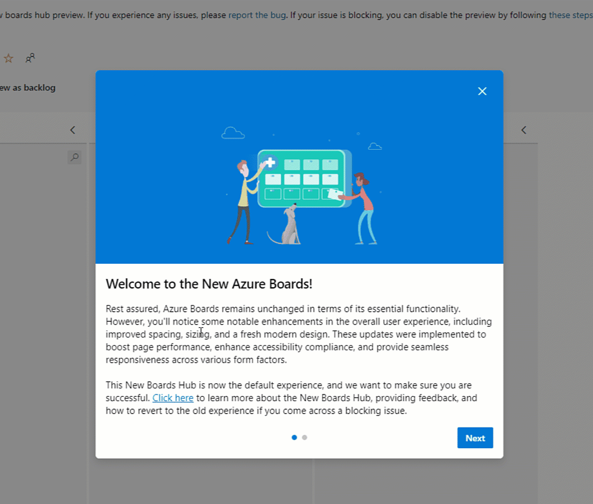

# New Boards Hub on by default

The [**New Boards Hub** preview](https://devblogs.microsoft.com/devops/new-boards-hub-public-preview/) will now be the default experience for all users. Users will have the ability to revert back to the old board hub for a short period of time while we continue to collect and address feedback on New Board Hub.

> [!div class="mx-imgBorder"]
> 