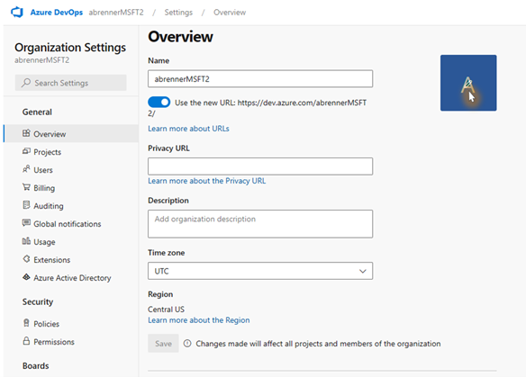

# Organization profile image

Organizations are represented today by an automatically generated image that can’t be changed. Enterprise customers would like their Azure DevOps organization to reflect their corporate branding and users accessing multiple organizations would like to be able to easily differentiate one from another. We’ll add the ability to add a custom organization profile image.

[Developer Community Suggestion](https://developercommunity.visualstudio.com/t/Can-Not-update-Organization-Settings-Ove/1329561)

> [!div class="mx-imgBorder"]
> 
