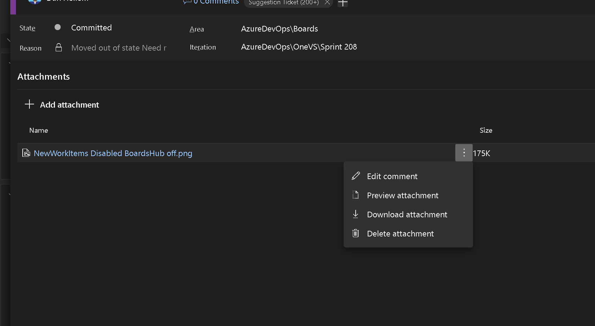
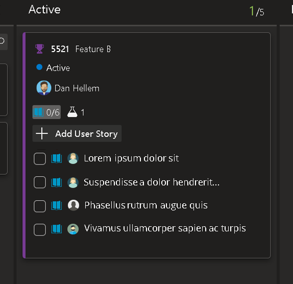
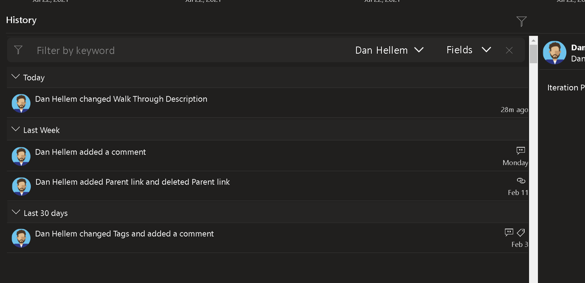

# Azure DevOps 2022 Q3 Features

## Admin
### Associate all public APIs with PAT scopes

Using scopes is a great way to limit the risk posed by [personal access tokens](https://docs.microsoft.com/azure/devops/organizations/accounts/use-personal-access-tokens-to-authenticate?toc=%2fazure%2fdevops%2forganizations%2ftoc.json&bc=%2fazure%2fdevops%2forganizations%2fbreadcrumb%2ftoc.json&view=azure-devops&tabs=preview-page) (PATs). We even have a policy allowing administrators to [restrict the creation of full-scoped PATs altogether](https://docs.microsoft.com/azure/devops/organizations/accounts/manage-pats-with-policies-for-administrators?view=azure-devops#restrict-creation-of-full-scoped-pats). 

However, some of our public APIs are currently unassociated with a PAT scope and can only be used with “full-scoped” PATs. Because of this, restricting the creation of full-scoped PATs might block some workflows. We're working to identify, document, and associate all our public APIs with the appropriate scopes.

## Boards

### Get Attachment URL link

As a user, I want to be able to go to an attachment, click on the context menu and get the url. This will allow me to cut and paste the url into discussions or descriptions so that I can have a discussion about a specific attachment. Readers can download that attachment directly from the link. When I paste the url it should show the name of the file (filename.txt) and that would be a link back to the attachment.  

> [!div class="mx-imgBorder"]
> 

[Suggestion Ticket](https://developercommunity.visualstudio.com/t/link-to-attachments-in-discussion/527072)

> [!NOTE]
> This feature will only be available with the [**New Boards Hubs** preview](https://devblogs.microsoft.com/devops/new-boards-hub-public-preview/).

### Adding Assigned To avatar to child items on cards

As a user, I want to see the assigned to avatar next to the tasks on the board cards. This would me to see what tasks are assigned to whom. I should also be assign the tasks directly from the action menu.

> [!div class="mx-imgBorder"]
> 

🚢 [Released in June of 2022](../../../release-notes/2022/sprint-205-update#assigned-to-children-in-kanban-cards)

> [!NOTE]
> This feature will only be available with the [**New Boards Hubs** preview](https://devblogs.microsoft.com/devops/new-boards-hub-public-preview/).

### Filter to work item history

As a user, when looking at the work item history, it is difficult to see who made changes to what fields. I want to be able to filter down revisions on the history tab. Filter by text, person who made the revision, and the fields being revised.

> [!div class="mx-imgBorder"]
> 

🚢 [Released in July of 2022](../../../release-notes/2022/sprint-206-update#filter-on-work-item-history)

> [!NOTE]
> This feature will only be available with the [**New Boards Hubs** preview](https://devblogs.microsoft.com/devops/new-boards-hub-public-preview/).

## Pipelines

### Pipelines scalability improvements

The usage of YAML pipelines continues to increase among our top customers. At the same time, the complexity of their pipelines also continues to increase in terms of number of stages, jobs, steps, conditions, checks, and templates. This results in much larger orchestration graphs (a data structure that we use internally to track each pipeline run). Another reason for the explosion in these graph sizes is the move from classic release pipelines to YAML pipelines. In classic releases, each stage was handled as a separate orchestration graph. In YAML pipelines, the entire run is a single orchestration graph.

As a result of various architectural choices we made over many years, we have been running into a few support cases for some of our largest customers. These problems arise only when you run several thousands of jobs each day and if the complexity of the orchestration graphs is high. In this effort, we will work on some architectural improvements to improve the scalability of the orchestration engine. This should help reduce bottlenecks in:

* Running hundreds of activity nodes per pipeline run
* Accessing the database to store or retrieve large graphs
* Running a large number of retries on checks in between stages

### Build retention improvements as part of next on-premises server release

In the [Safely Upgrade Your Pipelines from Azure DevOps Server 2019 to Server 2020](https://devblogs.microsoft.com/devops/safely-upgrade-from-azure-devops-server-2019-to-server-2020/) blog post, we called out some issues reported by customers as they upgrade from Azure DevOps Server 2019 to 2020. Azure DevOps Server 2019 had per-pipeline retention policies, while Azure DevOps Server 2020 had a hybrid policy with some per-pipeline retention rules and project level retention rules. The blog calls out specific scenarios in which some builds from Server 2019 may be deleted after the upgrade to 2020. It also calls out the steps one can take to avoid that loss.

The next release of Azure DevOps Server will have a simple retention model that is purely based on project-level settings. This model will be uniform between classic build pipelines as well as YAML pipelines. We are wrapping up the work on testing the upgrades from Server 2019 and Server 2020 to the new version and ensuring that there won't be any builds lost when you move from one model to another.

### Deprecate windows-2016, ubuntu-18, macOS-10.14, and macOS-10.15 images

Recently, we made Windows 2022 available as a hosted image. With the upcoming end of mainstream support for Windows 2016 in January 2022, we are deprecating vs2017-win2016 images starting November 15. The complete retirement of this image is planned for March 2022. Since this is a commonly used image, we wanted to give you enough notice and time to make necessary changes to your pipelines.

Recently, we also made macOS-11 available as a hosted image. As a result, we will be deprecating macOS-10.14 image in December 2021. Builds that rely on this image will fail once it is deprecated.

Refer to our [blog](https://devblogs.microsoft.com/devops/hosted-pipelines-image-deprecation/) for more details on this deprecation and the steps you can take to move to the newer versions.
