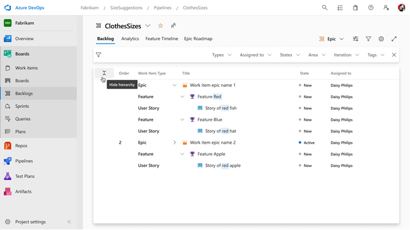

# Azure DevOps 2023 Q2 Features

## Boards

### Maintain backlog hierarchy when filters are applied

As a Boards user, I want to maintain my tree view even when I filter my backlog so that I don't lose context of the work I'm trying to organize.

> [!div class="mx-imgBorder"]
> 

### Emoji support in work item tags

Provider emoji support on work item tags (🤞🎉)

> [!div class="mx-imgBorder"]
> 

### Ability to change link type from Web UI

Add the ability to change link types from the web ui. 

### Save Comment Improvements

* Users can give read-only users permissions to just add comments​
* When adding a new comment, if the comment “Save” button is used, just the comment will be saved without running rules​
* Comment “Save” and standard work item save can both be used

> [!div class="mx-imgBorder"]
> 

https://developercommunity.visualstudio.com/t/separate-rights-for-work-item-discussion/365819
https://developercommunity.visualstudio.com/t/make-it-possible-to-disable-the-discussion-for-a-g/710375

## Pipelines

### Credential-free pipelines

Pipelines often depend on service connections that store secrets. A common use case for Pipelines is to deploy applications to Azure resources using an ARM service connection. Each connection stores either the Azure service principal's password or certificate in Azure DevOps. The main drawbacks of storing these credentials in Azure DevOps are (a) You will have to update the service connections in Azure DevOps every time you update them in Azure (b) Tasks in a pipeline will have access to these secrets. Many customers would like to avoid storing secrets in Azure DevOps. They do not want the trouble of rotating these secrets on a regular basis. And, they want to reduce the risk of these secrets getting exposed.

One way to do this is by using managed identity in ARM service connections. However, this approach only works with self-hosted agents or scale-set agents. As part of this work, we will explore how to make managed identity work with Microsoft-hosted agents. The goal of the resulting scheme is to promote credential-free pipelines that are simply based on managed identity, whose resource access can be managed within AAD.

The solution proposed as part of this work will be specific to Azure service connections and will not work for other types of service connections.

### Deprecate Node 10 from agent and tasks

The Azure Pipelines agent and a number of its tasks use either Node 6 or Node 10 as the runtime. Given the end of life for Node 10, we need to move to a newer version of Node. This is also required for us to support the next version of macOS. There is one important consequence of moving to a newer version of Node. The agent will no longer work on RHEL 6. Stay tuned for more updates here and in our release notes.

## Reporting

### Pull Request widget to allow for the selection of many repos

For the [Pull Request widget](https://docs.microsoft.com/azure/devops/report/dashboards/widget-catalog?view=azure-devops#pull-request). Allow the selection of many repositories to be added at one time. 

This feature will address the following developer community [suggestion ticket](https://developercommunity.visualstudio.com/t/allow-multiple-repository-selection-in-pull-reques/982784).

### Rollup columns for query results

Like backlogs, provide rollup columns to query results.

Addressing dev community suggestion ticket: [Add rollup columns on query results](https://developercommunity.visualstudio.com/t/could-you-add-rollup-columns-on-queries/758096)

### Show Link with Parent Name in Query Results Widget

The Query Results Widget will support the name, work item icon, and link for the Parent. When using the parent column in a query in the queries view, a link to the parent item is displayed with an icon showing the work item type. However, the same query on a Query Results widget on a dashboard only shows the ID of the Parent work item.