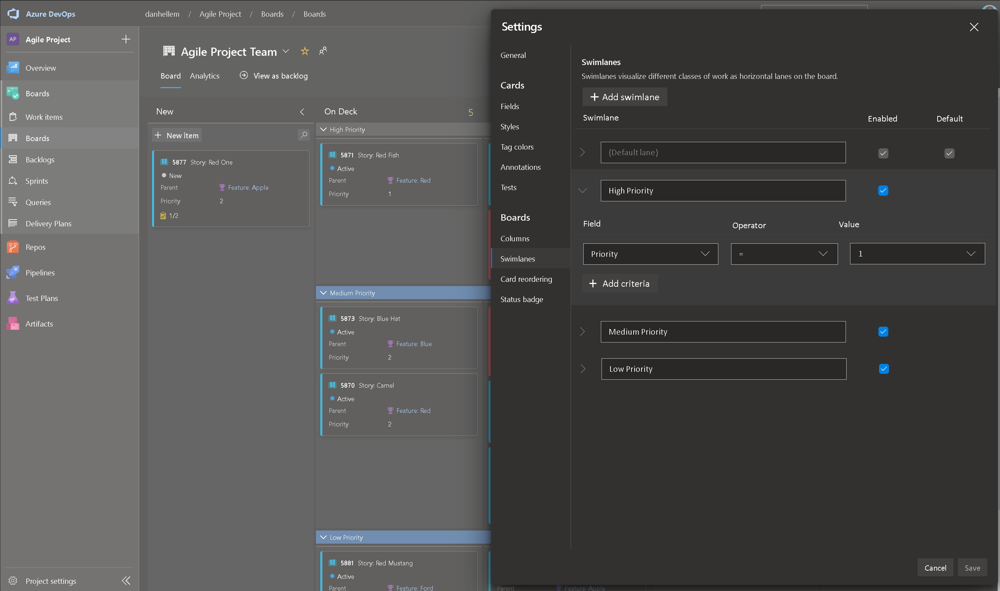
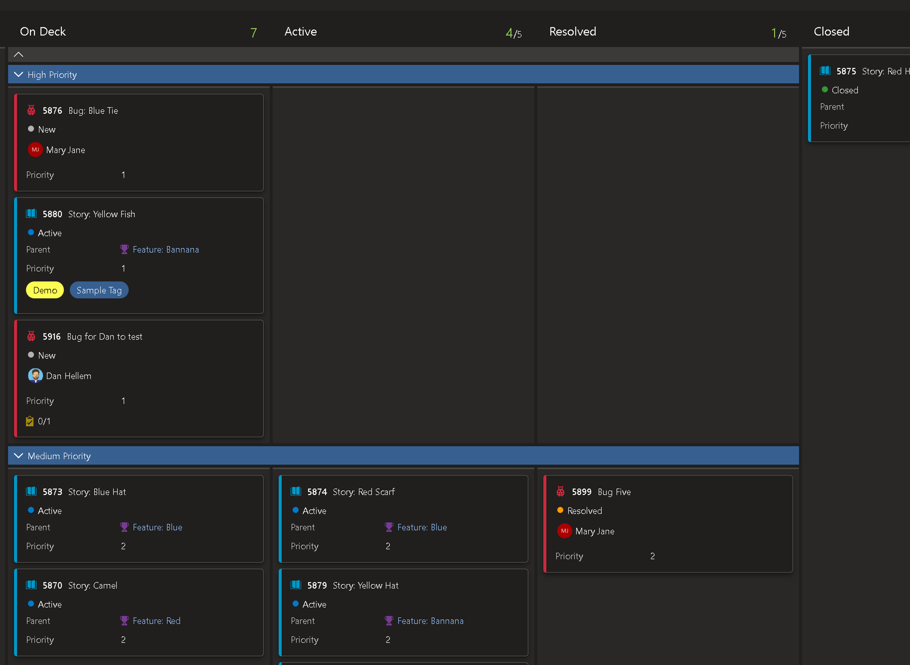

# Swimlane rules

As a user, I want to setup rules that automatically move work items to a specific swimlane based on a field values. For example, I want priority 1 items to be in the **High Priority** swimlane and priority 2 items in the **Medium Priority** swimlane. 

[Community Suggestion Ticket](https://developercommunity.visualstudio.com/t/swimlanes-rules/365710)

> [!div class="mx-imgBorder"]
> 

When the priority of the work items changes, it should automatically be placed into the correct swimlane. Also, if I drag a work item from the **Medium Priority** lane to the **High Priority** lane, the work item priority field should be get updated accordingly.

> [!div class="mx-imgBorder"]
> 

> [!NOTE]
> This feature will only be available with the [**New Boards Hubs** preview](https://devblogs.microsoft.com/devops/new-boards-hub-public-preview/).