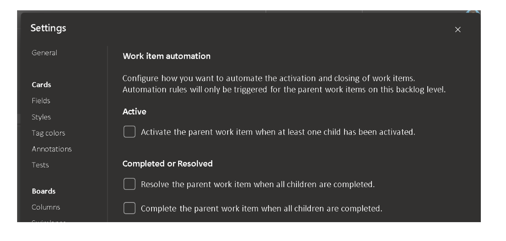

# Team rules for work item automation

As a team, we want to setup rules to automate the update of parent work items depending on the state of the child work item(s). Examples include:

- When a single task is changed to active, set the parent to active
- When all tasks are completed, set the parent to completed

These rules should be set at the team level to allow different teams to work how they like.

[Community Suggestion Ticket](https://developercommunity.visualstudio.com/t/update-automatically-user-story-state-according-to/376465)

> [!div class="mx-imgBorder"]
> 

> [!NOTE]
> This feature will only be available with the [**New Boards Hubs** preview](https://devblogs.microsoft.com/devops/new-boards-hub-public-preview/).